# Solving exercises

You may want to check out [this pdf file](./teoria-dos-conjuntos1.pdf) in order to read more about set theory and the needed properties to perform operations between them.

The __bold text__ will be used to denote a problem which solution will be achieved using formulas. The *italic text* will be used to denote a problem which solution will be achieved using the [Venn diagram](https://www.mathsisfun.com/sets/venn-diagrams.html), in this case the [lucid chart tool](https://www.lucidchart.com/pages/pt/exemplos/diagrama-de-venn-online) will be used to plot the diagrams.

## Exercises

1. [Question No. 1](https://github.com/Bodera/learnPath_Mathematics/blob/master/discrete-math/set-theory-solved.md#question-no-1)
2. [Question No. 2](https://github.com/Bodera/learnPath_Mathematics/blob/master/discrete-math/set-theory-solved.md#question-no-2)
3. [Question No. 3](https://github.com/Bodera/learnPath_Mathematics/blob/master/discrete-math/set-theory-solved.md#question-no-3)
4. [Question No. 4](https://github.com/Bodera/learnPath_Mathematics/blob/master/discrete-math/set-theory-solved.md#question-no-4)
5. [Question No. 5](https://github.com/Bodera/learnPath_Mathematics/blob/master/discrete-math/set-theory-solved.md#question-no-5)
6. [Question No. 6](https://github.com/Bodera/learnPath_Mathematics/blob/master/discrete-math/set-theory-solved.md#question-no-6)
7. [Question No. 7](https://github.com/Bodera/learnPath_Mathematics/blob/master/discrete-math/set-theory-solved.md#question-no-7)
8. [Question No. 8](https://github.com/Bodera/learnPath_Mathematics/blob/master/discrete-math/set-theory-solved.md#question-no-8)
9. [Question No. 9](https://github.com/Bodera/learnPath_Mathematics/blob/master/discrete-math/set-theory-solved.md#question-no-9)
10. [Question No. 10](https://github.com/Bodera/learnPath_Mathematics/blob/master/discrete-math/set-theory-solved.md#question-no-10)
11. [Question No. 11](https://github.com/Bodera/learnPath_Mathematics/blob/master/discrete-math/set-theory-solved.md#question-no-11)
12. [Question No. 12](https://github.com/Bodera/learnPath_Mathematics/blob/master/discrete-math/set-theory-solved.md#question-no-12)
13. [Question No. 13](https://github.com/Bodera/learnPath_Mathematics/blob/master/discrete-math/set-theory-solved.md#question-no-13)
14. [Question No. 14](https://github.com/Bodera/learnPath_Mathematics/blob/master/discrete-math/set-theory-solved.md#question-no-14)
15. [Question No. 15](https://github.com/Bodera/learnPath_Mathematics/blob/master/discrete-math/set-theory-solved.md#question-no-15)
16. [Question No. 16](https://github.com/Bodera/learnPath_Mathematics/blob/master/discrete-math/set-theory-solved.md#question-no-16)
17. [Question No. 17](https://github.com/Bodera/learnPath_Mathematics/blob/master/discrete-math/set-theory-solved.md#question-no-17)
18. [Question No. 18](https://github.com/Bodera/learnPath_Mathematics/blob/master/discrete-math/set-theory-solved.md#question-no-18)
19. [Question No. 19](https://github.com/Bodera/learnPath_Mathematics/blob/master/discrete-math/set-theory-solved.md#question-no-19)
20. [Question No. 20](https://github.com/Bodera/learnPath_Mathematics/blob/master/discrete-math/set-theory-solved.md#question-no-20)
21. [Question No. 21](https://github.com/Bodera/learnPath_Mathematics/blob/master/discrete-math/set-theory-solved.md#question-no-21)
22. [Question No. 22](https://github.com/Bodera/learnPath_Mathematics/blob/master/discrete-math/set-theory-solved.md#question-no-22)
23. [Question No. 23](https://github.com/Bodera/learnPath_Mathematics/blob/master/discrete-math/set-theory-solved.md#question-no-23)
24. [Question No. 24](https://github.com/Bodera/learnPath_Mathematics/blob/master/discrete-math/set-theory-solved.md#question-no-24)
25. [Question No. 25](https://github.com/Bodera/learnPath_Mathematics/blob/master/discrete-math/set-theory-solved.md#question-no-25)
26. [Question No. 26](https://github.com/Bodera/learnPath_Mathematics/blob/master/discrete-math/set-theory-solved.md#question-no-26)
27. [Question No. 27](https://github.com/Bodera/learnPath_Mathematics/blob/master/discrete-math/set-theory-solved.md#question-no-27)
28. [Question No. 28](https://github.com/Bodera/learnPath_Mathematics/blob/master/discrete-math/set-theory-solved.md#question-no-28)
29. [Question No. 29](https://github.com/Bodera/learnPath_Mathematics/blob/master/discrete-math/set-theory-solved.md#question-no-29)
30. [Question No. 30](https://github.com/Bodera/learnPath_Mathematics/blob/master/discrete-math/set-theory-solved.md#question-no-30)
31. [Question No. 31](https://github.com/Bodera/learnPath_Mathematics/blob/master/discrete-math/set-theory-solved.md#question-no-31)
32. [Question No. 32](https://github.com/Bodera/learnPath_Mathematics/blob/master/discrete-math/set-theory-solved.md#question-no-32)
33. [Question No. 33](https://github.com/Bodera/learnPath_Mathematics/blob/master/discrete-math/set-theory-solved.md#question-no-33)
34. [Question No. 34](https://github.com/Bodera/learnPath_Mathematics/blob/master/discrete-math/set-theory-solved.md#question-no-34)
35. [Question No. 35](https://github.com/Bodera/learnPath_Mathematics/blob/master/discrete-math/set-theory-solved.md#question-no-35)
36. [Question No. 36](https://github.com/Bodera/learnPath_Mathematics/blob/master/discrete-math/set-theory-solved.md#question-no-36)
37. [Question No. 37](https://github.com/Bodera/learnPath_Mathematics/blob/master/discrete-math/set-theory-solved.md#question-no-37)
38. [Question No. 38](https://github.com/Bodera/learnPath_Mathematics/blob/master/discrete-math/set-theory-solved.md#question-no-38)
39. [Question No. 39](https://github.com/Bodera/learnPath_Mathematics/blob/master/discrete-math/set-theory-solved.md#question-no-39)
40. [Question No. 40](https://github.com/Bodera/learnPath_Mathematics/blob/master/discrete-math/set-theory-solved.md#question-no-40)
41. [Question No. 41](https://github.com/Bodera/learnPath_Mathematics/blob/master/discrete-math/set-theory-solved.md#question-no-41)
42. [Question No. 42](https://github.com/Bodera/learnPath_Mathematics/blob/master/discrete-math/set-theory-solved.md#question-no-42)
43. [Question No. 43](https://github.com/Bodera/learnPath_Mathematics/blob/master/discrete-math/set-theory-solved.md#question-no-43)
44. [Question No. 44](https://github.com/Bodera/learnPath_Mathematics/blob/master/discrete-math/set-theory-solved.md#question-no-44)
45. [Question No. 45](https://github.com/Bodera/learnPath_Mathematics/blob/master/discrete-math/set-theory-solved.md#question-no-45)
46. [Question No. 46](https://github.com/Bodera/learnPath_Mathematics/blob/master/discrete-math/set-theory-solved.md#question-no-46)
47. [Question No. 47](https://github.com/Bodera/learnPath_Mathematics/blob/master/discrete-math/set-theory-solved.md#question-no-47)
48. [Question No. 48](https://github.com/Bodera/learnPath_Mathematics/blob/master/discrete-math/set-theory-solved.md#question-no-48)
49. [Question No. 49](https://github.com/Bodera/learnPath_Mathematics/blob/master/discrete-math/set-theory-solved.md#question-no-49)
50. [Question No. 50](https://github.com/Bodera/learnPath_Mathematics/blob/master/discrete-math/set-theory-solved.md#question-no-50)
51. [Question No. 51](https://github.com/Bodera/learnPath_Mathematics/blob/master/discrete-math/set-theory-solved.md#question-no-51)
52. [Question No. 52](https://github.com/Bodera/learnPath_Mathematics/blob/master/discrete-math/set-theory-solved.md#question-no-52)

### Question No. 1

Being the sets:

```txt
  A = {0, 3, 7}
  B = {0, 3, 5}
```  

Using the symbols ∈ and ∉, list:

a) (∈) 3 and A - 3 belongs to A  
b) (∉) 1 and B - 1 does not belong to B  
c) (∈) 3 and B - 3 belongs to B  
d) (∈) 0 and A - 0 belongs to A  
e) (∉) 5 and A - 5 does not belong to A  
f) (∈) 7 and A - 7 belongs to A  
g) (∉) 7 and B - 7 does not belong to B  
h) (∉) 2 and B - 2 does not belong to B  

### Question No. 2

Consider the sets

```txt
  A = {1, 2}
  B = {1, 2, 3}
  C = {1, 2, 3, 7, 8}
  D = {3, 7}
```  

Using the symbols ⊂ and ⊄, relate the sets to each other:

a) (⊂) A and B - A is contained in B  
b) (⊂) A and C - A is contained in C  
c) (⊄) A and D - A not contained in D  
d) (⊂) B and C - B is contained in C  
e) (⊄) D and A - D not contained in A  
f) (⊄) D and B - D not contained in B  
g) (⊂) D and C - D is contained in C  

### Question No. 3

In the diagram below, A, B and C are three non-empty sets. Check `T` or `F` for each of the sentences, depending on whether it is true or false:


a) (T) A ⊂ C - A is contained in C  
b) (T) B ⊂ C - B is contained in C  
c) (F) C ⊂ A - C is contained in A  
d) (F) A ⊂ B - A is contained in B  
e) (T) C ⊄ A - C not contained in A  
f) (T) A ⊄ B - A is contained in B  
g) (T) C ⊃ A - C contains A  
h) (T) A ⊅ C - A does not contain C  
i) (F) B ⊃ C - B contains C  
j) (F) C ⊂ B - C is contained in B  

### Question No. 4

Given the set:

```txt
  A = {0, 1, 2, {3}}
```  

Say whether the following propositions are true (T) or false (F):

a) (T) 0 ∈ A - 0 belongs to A  
b) (F) 1 ⊂ A - 1 is contained in A  
c) (T) {3} ∈ A - {3} belongs to A  
d) (F) {3} ⊂ A - {3} is contained in A  
e) (T) {1, 2} ⊂ A - {1, 2} is contained in A  
f) (T) ∅ ⊂ A - ∅ is contained in A  
g) (F) ∅ ∈ A - ∅ belongs to A  
h) (F) 3 ∈ A - 3 belongs to A  
i) (F) {3} ∉ A - {3} does not belong to A  
j) (F) 0 ⊂ A - 0 is contained in A  

### Question No. 5

Given the sets:

```txt
  A = {0, 1, 2, 3}
  B = {0, 2, 3, 5}
  C = {0, 2, 4, 6, 8}
  D = {5, 7, 9}
```

determine:

a) A ∪ B  

```txt
  A ∪ B = {0, 1, 2, 3, 5}
```  

b) A ∪ C  

```txt
  A ∪ C = {0, 1, 2, 3, 4, 6, 8}
```  

c) A ∪ D  

```txt
  A ∪ D = {0, 1, 2, 3, 5, 7, 9}
```  

d) B ∪ C  

```txt
  B ∪ C = {0, 2, 3, 4, 5, 6, 8}
```  

e) B ∪ D  

```txt
  B ∪ D = {0, 2, 3, 5, 7, 9}
```  

f) C ∪ D  

```txt
  C ∪ D = {0, 2, 4, 5, 6, 7, 8, 9}
```  

g) (A ∪ B) ∪ C  

```txt
  (A ∪ B) ∪ C = {0, 1, 2, 3, 4, 5, 6, 8}
```  

h) (B ∪ C) ∪ D  

```txt
  (B ∪ C) ∪ D = {0, 2, 3, 4, 5, 6, 7, 8, 9}
```  

i) (A ∪ C) ∪ D  

```txt
  (A ∪ C) ∪ D = {0, 1, 2, 3, 4, 5, 6, 7, 8, 9}
```  

j) (B ∪ D) ∪ A  

```txt
  (B ∪ D) ∪ A = {0, 1, 2, 3, 5, 7, 9}
```  

### Question No. 6

With the same set:

```txt
  A = {0, 1, 2, 3}
  B = {0, 2, 3, 5}
  C = {0, 2, 4, 6, 8}
  D = {5, 7, 9}
```

determine:

a) A ∩ B  

```txt
  A ∩ B = {0, 2, 3}
```  

b) A ∩ C  

```txt
  A ∩ C = {0, 2}
```  

c) A ∩ D  

```txt
  A ∩ D = {∅}
```  

d) B ∩ C  

```txt
  B ∩ C = {0, 2}
```  

e) B ∩ D  

```txt
  B ∩ D = {5}
```  

f) C ∩ D  

```txt
  C ∩ D = {∅}
```  

g) (A ∩ B) ∩ C  

```txt
  (A ∩ B) ∩ C = {0, 2}
```  

h) (B ∩ C) ∩ D  

```txt
  (B ∩ C) ∩ D = {∅}
```  

i) (A ∩ C) ∩ D  

```txt
  (A ∩ C) ∩ D = {∅}
```  

j) (B ∩ D) ∩ A  

```txt
  (B ∩ D) ∩ A = {∅}
```  

### Question No. 7

With the same set:

```txt
  A = {0, 1, 2, 3}
  B = {0, 2, 3, 5}
  C = {0, 2, 4, 6, 8}
  D = {5, 7, 9}
```

determine:

a) A − B  

```txt
  A - B = {1}
```  

b) A − C  

```txt
  A - C = {1, 3}
```  

c) A − D  

```txt
  A - D = {0, 1, 2, 3}
```  

d) B − C  

```txt
  B - C = {3, 5}
```  

e) B − D  

```txt
  B - D = {0, 2, 3}
```  

f) C − D  

```txt
  C − D = {0, 2, 4, 6, 8}
```  

g) (A − B) − C  

```txt
  (A − B) − C = {1}
```  

h) (B − C) − D  

```txt
  (B − C) − D = {3}
```  

i) (A − C) − D  

```txt
  (A − C) − D = {1, 3}
```  

j) (B − D) − A  

```txt
  (B − D) − A = {∅}
```  

### Question No. 8

Consider the sets:

```txt
  A = {0, 1, 2, 3, 4, 5, 6, 7}
  B = {0, 2, 5}
  C = {1, 3, 5, 7}
  D = {2, 4, 6}
```

determine:

a) Complementary of B in A  

```txt
  B - A = {1, 3, 4, 6, 7}
```

b) Complementary of C in A  

```txt
  C - A = {0, 2, 4, 6}
```

c) Complementary of D in A  

```txt
  D - A = {0, 1, 3, 5, 7}
```

d) Complementary of (B ∩ C ∩ D) in A  

```txt
  (B ∩ C ∩ D) - A = {0, 1, 2, 3, 4, 5, 6, 7}
```

### Question No. 9

In a research on preference over two newspapers, 470 people were consulted and the result was as follows: 250 of them read the newspaper A, 180 read newspaper B and 60 read both newspapers.
The following questions are asked:

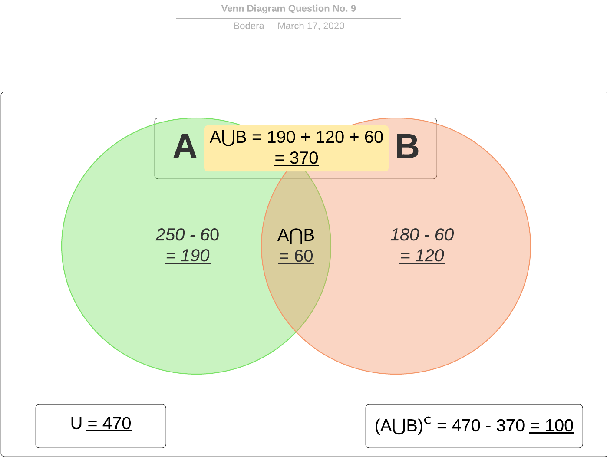

a) How many people read only newspaper A?  __190__  
b) How many people read only newspaper B?  __120__  
c) How many people read newspapers?  __370__  
d) How many people do not read newspapers?  __100__  

### Question No. 10

In a city, three products A, B and C are consumed. A market survey was conducted on the consumption of these products and the following result was obtained:

|      Product      | Number of consumers |
|:-----------------:|:-------------------:|
|         A         |         150         |
|         B         |         200         |
|         C         |         250         |
|      A and B      |          70         |
|      A and C      |          90         |
|      B and C      |          80         |
|     A, B and C    |          60         |
| None of the three |         180         |

The following questions are asked:

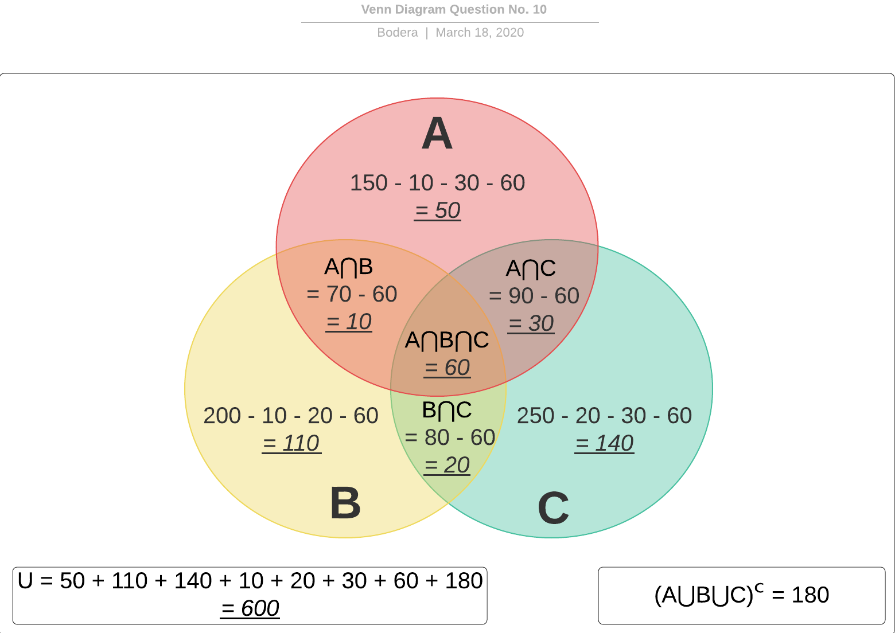

a) How many people consume only product A?  __50__  
b) How many people consume product A or product B or product C?  

```txt
(A + B + C) + (A ∩ B) + (B ∩ C) + (A ∩ C) + (A ∩ B ∩ C)
= 300 + (10 + 20 + 30 + 60)
= 300 + 120
= 420
```

c) How many people consume product A or product B?  

```txt
(A + B) + (A ∩ B) + (B ∩ C) + (A ∩ C) + (A ∩ B ∩ C)
= 160 + (10 + 20 + 30 + 60)
= 160 + 120
= 280
```

d) How many people were consulted?  __600__  

### Question No. 11

A test was made up of two problems. 300 students hit only one, 260 hit the second, 100 students hit both and 210 missed the first. How many students took the test?

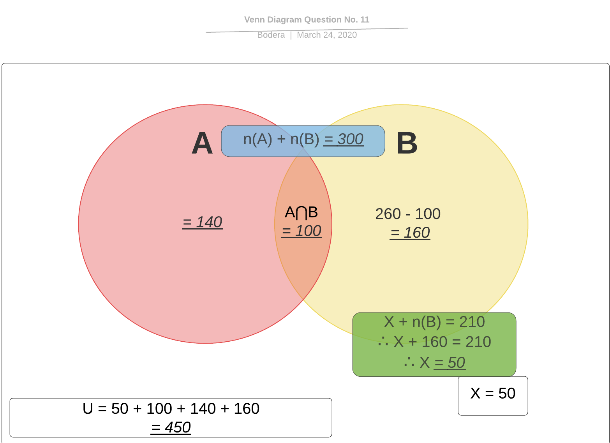

__Answer:__  

```txt
450 students took the test.
```

### Question No. 12

According to the theory, a set with m elements has exactly 2ᵐ subsets. Using this reasoning, determine the number of elements in set A, knowing that:

1. B is a set of three elements;  
2. A ∩ B is empty;  
3. The number of subsets of A ∪ B is 32.  

__Answer:__  

```txt
1 => P(B) = 2³ => 8
2 => A ∩ B = {∅}
3 => A ∪ B = P(32) => A ∪ 3 = 2⁵ => 2 ∪ 3 = 5

A is a set of two elements.
```

### Question No. 13

A publisher is studying the possibility of launching the publications HELENA, SENHORA and A MORENINHA again. For this, it carried out a market research and concluded that for every 1,000 people consulted, 600 read MORENINHA, 400 read HELENA, 300 read LADY, 200 read MORENINHA and HELENA, 150 read MORENINHA and LADY, 100 read HELENA and LADY and 20 read the three works.
It is questioned:


a) How many people read only one of the three works?  

```txt
(H ∪ M ∪ S)
= 270 + 120 + 70
= 460
```

b) How many people have not read any of the three works?  

```txt
Complementary of (H ∪ M ∪ S)
= 130
```

c) How many people read two or more works?  

```txt
(H ∩ S) + (M ∩ S) + (H ∩ M) + (H ∩ S ∩ M)
= 80 + 130 + 180 + 20
= 410
```

### Question No. 14

In a group of 99 athletes, 40 play volleyball, 20 play volleyball and basketball, 22 play basketball and football, 18 play volleyball and football, 11 play all three. The number of people who play basketball is equal to the number of people who play football.
It is questioned:

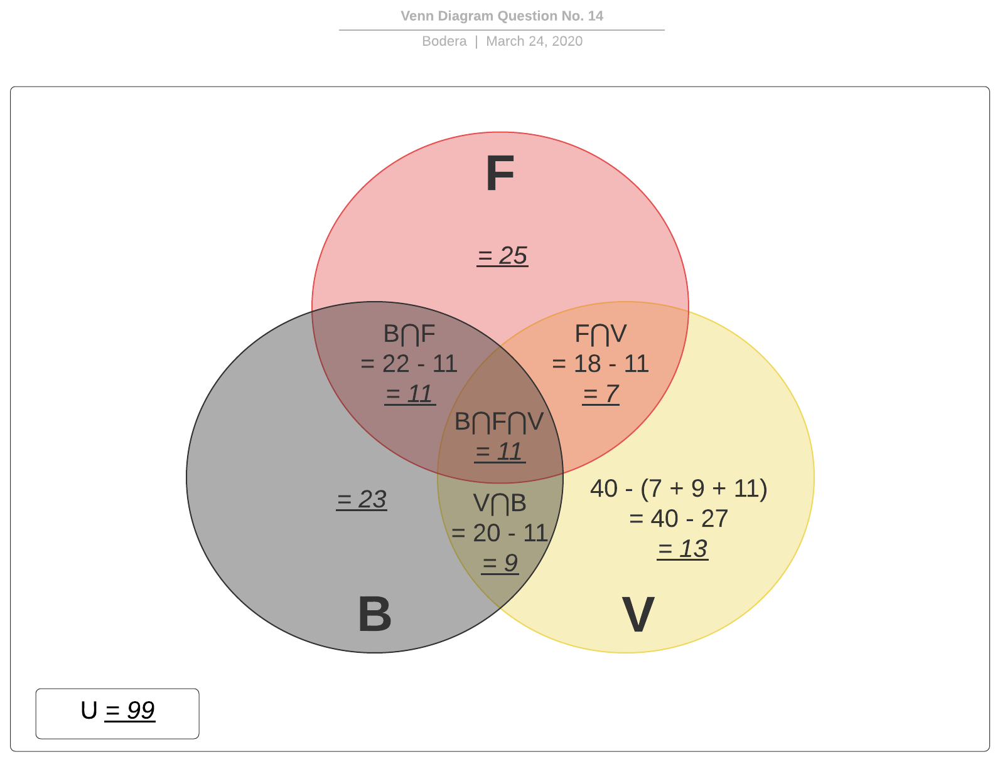

a) How many play football and do not play volleyball?  

```txt
F + (B ∩ F)
= 25 + 11
= 36
```

b) How many play basketball and do not play volleyball?  

```txt
B + (F ∩ B)
= 23 + 11
= 34
```

c) How many play volleyball and do not play basketball?  

```txt
V + (F ∩ V)
= 13 + 7
= 20
```

### Question No. 15

Given the diagram below, color the region (A ∩ B) ∪ (A ∩ C).

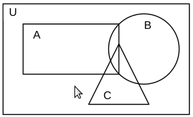

__Answer__:

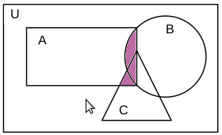

### Question No. 16

__Answers__:
a) What is called the set that has only one element?  __Unitary__  
b) If A ∩ B = ∅, what are the sets A and B called?  __Disjoint sets__  
c) If a set A has 3 elements and a set B has 5 elements, how many elements does set A ∩ B will have at most?  __3 elements__  
d) If A and B are disjoint, how many elements will the set A ∩ B have?  __0, none. The intersection of disjoint sets is ∅.__  

### Question No. 17

In the sentences below, *T* is used to mark the true sentences and *F* the false ones.

a) {2} ∈ {0, 1, 2} - {2} belongs to {0, 1, 2}  
b) ∅ ⊂ {5, 6, 7} - *void* is contained in {5, 6, 7}  
c) ∅ ∈ {∅, 4} - *void* belongs to {∅, 4}  
d) 5 ∈ {3, {5, 1}, 4} - 5 belongs to {3, {5, 1}, 4}  
e) {5, 6} ⊃ {5, 6, 7} - {5, 6} contains {5, 6, 7}  

__Answers__:

a) __F__  
b) __T__  
c) __T__  
d) __F__  
e) __F__  

### Question No. 18

Which of the sentences below is true?

a) 0 = {0} - 0 is equals to {0}  
b) 0 ∈ ∅ - 0 belongs to *void*  
c) { } = ∅ - { } is equals to *void*  
d) {{ }} = ∅ - {{ }} is equals to *void*  

__Answers__:

Letter __C__ is true.

### Question No. 19

Being A = {1, 2, {1}, {2, 3}}, which of the propositions below is false?

a) 1 ∈ A - 1 belongs to A  
b) {3} ∈ A - {3} belongs to A  
c) {1} ∈ A - {1} belongs to A  
d) A has four elements in total  

__Answers__:

Letter __B__ is false.

### Question No. 20

Given the set A = {1, {2}, 2}, which of the relationships below is false?

a) {2} ∈ A - {2} belongs to A  
b) {1} ∈ A - {1} belongs to A  
c) {1, 2} ⊂ A - {1, 2} is contained in A  
d) {2} ⊂ A - {2} is contained in A  
e) {2, {2}} ⊂ A - {2, {2}} is contained in A  

__Answers__:

Letter __B__ is false.

### Question No. 21

Given the set A = {3, {3}}, and the propositions:

I. 3 ∈ A  
II. {3} ⊂ A  
III. {3} ∈ A  

So which of them are true?

__Answer__:

All propositions are true.

### Question No. 22

If A = {∅, 3, {3}, {2, 3}}, so:

a) {2, 3} ⊂ A - {2, 3} is contained in A  
b) 2 ∈ A - 2 belongs to A  
c) ∅ ∉ A - *void* does not belong to A  
d) 3 ⊂ A - 3 is contained in A  
e) {3} ∈ A - {3} belongs to A  

__Answer__:

Letter __E__ is correct.

### Question No. 23

In the diagram below, we have that:

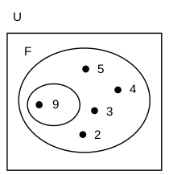

a) 3 ∈ P(F) - 3 belongs to a part of F  
b) {4, 5} ⊂ P(F) - {4, 5} is contained in a part of F  
c) {3} ∉ P(F) - {3} does not belong to a part of F  
d) {2, 3} ⊂ P(F) - {2, 3} is contained in a part of F  
e) {{9}} ∈ P(F) - {{9}} belongs to a part of F  

`Hint`

```txt
F has a total of 5 elements
F = {2, 3, 4, 5, {9}}
The total subsets that we can form from F is = 2⁵
2 ^ 5 = 32

a subset without elements: {∅}
a subset with a single element: {2}; {3}; {4}; {5}; {{9}}
a subset with two elements: {2, 3}; {2, 4}; {2, 5}; {2, {9}}; {3, 4};
                            {3, 5}; {3, {9}}; {4, 5}; {4, {9}}; {5, {9}}
a subset with three elements: {2, 3, 4}; {2, 3, 5}; {2, 3, {9}}; {2, 4, 5}; {2, 4, {9}}; {2, 5, {9}};
                              {2, 5, {9}}; {3, 4, 5}; {3, 4, {9}}; {3, 5, {9}}; {4, 5, {9}};
a subset with four elements: {2, 3, 4, 5}; {2, 3, 4, {9}}; {2, 4, 5, {9}}; {3, 4, 5, {9}};
a subset with five elements: {2, 3, 4, 5, {9}}
```

__Answer__:

Letter __E__ is correct.

### Question No. 24

Consider the following sets of natural numbers:

i. A = {x ∈ ℕ | 0 ≤ x ≤ 25}
ii. B = {x ∈ ℕ | 16 ≤ x < 25}

The number of elements in the set A ⋂ B is?

a) 9  
b) 10  
c) 11  
d) 12  

`Hint`

```txt
A ⋂ B = {16, 17, 18, 19, 20, 21, 22, 23, 24}

A total of 9 elements.
```

__Answer__:

Letter __A__ is correct.

### Question No. 25

Consider the following sets of natural numbers:

i. A = {x ∈ ℕ | 1 ≤ x ≤ 20}
ii. B = {x ∈ ℕ | 17 < x ≤ 25}

The number of subsets in A ⋂ B is equal to:

a) 3  
b) 4  
c) 6  
d) 8  

`Hint`

```txt
A ⋂ B has a total of 3 elements.
A ⋂ B = {18, 19, 20}
The total subsets that we can form from A ⋂ B is = 2³
2 ^ 3 = 8

a subset without elements: {∅}
a subset with a single element: {18}; {19}; {20}
a subset with two elements: {18, 19}; {18, 20}; {19, 20}
a subset with three elements: {18, 19, 20}
```

__Answer__:

Letter __D__ is correct.

### Question No. 26

Let A be a set with 8 elements. The number of subsets in A is?

a) 8  
b) 256  
c) 6  
d) 128  

`Hint`

```txt
A has a total of 8 elements.
A = {a, b, c, d, e, f, g, h}
The total subsets that we can form from A = 2⁸
2 ^ 8 = 256

a subset without elements: {∅}
a subset with a single element: {...}
a subset with two elements: {...}
a subset with three elements: {...}
a subset with four elements: {...}
a subset with five elements: {...}
a subset with six elements: {...}
a subset with seven elements: {...}
a subset with eight elements: {a, b, c, d, e, f, g, h}

We've already proved it.
```

__Answer__:

Letter __B__ is correct.

### Question No. 27

Given the set E = {1, 2, 4, 8}, does it have how many subsets?

a) 8  
b) 16  
c) 32  
d) 64  

`Hint`

```txt
E has a total of 4 elements.
The total subsets that we can form from A = 2⁴
2 ^ 4 = 16

a subset without elements: {∅}
a subset with a single element: {...}
a subset with two elements: {...}
a subset with three elements: {...}
a subset with four elements: {1, 2, 3, 4}

We've already proved it.
```

__Answers__:

Letter __B__ is correct.

### Question No. 28

What is the set of parts of the empty set?

a) ∅  
b) {∅}  
c) {∅, {∅}}  
d) {{∅}}  

`Hint`

```txt
∅ = {∅}
∅ has a total of 0 elements.
The total subsets that we can form from ∅ = 2⁰
2 ^ 0 = 1

a subset without elements: {∅}
```

__Answer__:

Letter __B__ is correct.

### Question No. 29

What is the set of parts of the set {∅}?

a) ∅  
b) {∅}  
c) {∅, {∅}}  
d) {{∅}}  

`Hint`

```txt
{∅} = {∅, {∅}}
{∅} has a total of 1 elements.
The total subsets that we can form from {∅} = 2¹
2 ^ 1 = 2

a subset without elements: {∅}
a subset with a single elements: {{∅}}
```

__Answer__:

Letter __C__ is correct.

### Question No. 30

Given the sets:

i. A = {a, b, c}
ii. B = {b, c, d}
iii. C = {a, c, d, e}

We can say that the set P = (A - C) ∪ (C - B) ∪ (A ∩ B ∩ C) is:

a) {a, b, c, e}  
b) {a, c, e}  
c) A  
d) {b, d, e}  

`Hint`

```txt
A - C = {b}
C - B = {a, e}
A ∩ B ∩ C = {c}

P = (A - C) ∪ (C - B) ∪ (A ∩ B ∩ C)
P = {a, b, c, e}
```

__Answer__:

Letter __A__ is correct.

### Question No. 31

Given:

i. A = {1, 3, 5, 7, 9, 11}
ii. B = {1, 2, 3, 4, 5}
iii. C = {2, 4, 7, 8, 9, 10}

So, the set (A ∪ B) ∩ C - A is equal to:

a) {2, 4}  
b) {4}  
c) {2, 4, 8}  
d) {1, 3, 5, 11}  

`Hint`

```txt
A ∪ B = {1, 2, 3, 4, 5, 7, 9, 11}
(A ∪ B) ∩ C = {2, 4, 7, 9}
(A ∪ B) ∩ C - A = {2, 4}
```

__Answer__:

Letter __A__ is correct.

### Question No. 32

Let A ✤ B be the symmetric difference of sets A and B, defined by A ✤ B as = (A - B) ∪ (B - A). Since:

i. A = {a, b, c}
ii. B = {b, c, d, e, f}

Then A ✤ B is which set?

a) {a, d, e, f}  
b) {b, c, d, f}  
c) ∅  
d) {a}  
e) A ∩ C  

`Hint`

```txt
A - B = {a}
B - A = {d, e, f}
(A - B) ∪ (B - A) = {a, d, e, f}
```

__Answer__:

Letter __A__ is correct.

### Question No. 33

Consider the statements about the set U knowing that U = {0, 1, 2, 3, 4, 5, 6, 7, 8, 9}.

I. ∅ ∈ U and n(U) = 10  
II. ∅ ⊂ U and n(U) = 10  
III. 5 ∈ U and {5} ⊂ U  
IV. {0, 1, 2, 5} ∩ {5} = 5  

Then it can be said that it is true:

a) only I and III  
b) only II and IV  
c) only II and III  
d) only IV  
e) all the statements are true  

`Hint`

```txt
U = {0, 1, 2, 3, 4, 5, 6, 7, 8, 9}; ∅ is not an element of U.
{∅} is contained in U. U also has 10 elements.
5 belongs to U and also {5} is contained in U.
{0, 1, 2, 5} ∩ {5} is not equals to 5.
```

__Answer__:

Letter __C__ is correct.

### Question No. 34

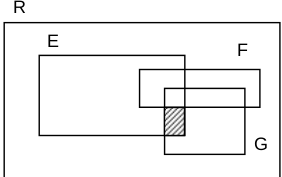

In the diagram above, does the shaded part represent:

a) (E ∩ F) ∩ G  
b) E ∩ G  
c) Cᵣ (E ∪ F)  
d) (E ∩ G) - F  
e) E - G  

__Answer__:

Letter __D__ is correct.

### Question No. 35

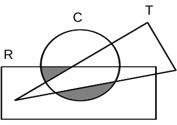

In the figure, R is a rectangle, T is a triangle and C is a circle. The hatched region is:

a) C - (R ∩ T)  
b) (T ∪ C) - R  
c) (R ∩ C) - T  
d) (T ∩ C) - R  

__Answer__:

Letter __C__ is correct.

### Question No. 36

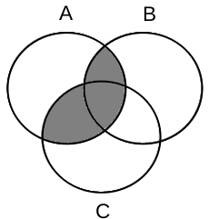

The hatched part of the graph above is:

a) A ∩ (B ∪ C)  
b) (A ∩ B) ∪ C  
c) (A ∪ B) ∩ C  
d) A ∪ (B ∩ C)  

__Answer__:

Letter __A__ is correct.

### Question No. 37

Given A, B and C, non-empty sets where A ⊂ B, it is always true that:

a) A ∩ B = ∅  
b) B ∩ C = A  
c) B ∩ C = ∅  
d) (A ∪ B) ⊂ C  
e) (A ∩ C) ⊂ B

`Hint`

```txt
A ∩ B = A
B ∩ C = Undefined. Not enough info about C
B ∩ C = Undefined. Not enough info about C
(A ∪ B) ⊂ C = Undefined. Not enough info about C
(A ∩ C) ⊂ B = True.
```

__Answer__:

Letter __E__ is correct.

### Question No. 38

If A, B and A ∩ B are sets with 90, 50 and 30 elements, respectively, then the number of elements in the set A ∪ B is:

a) 10  
b) 70  
c) 85  
d) 110  
e) 170  

`Hint`

```txt
A ∪ B = (A + B) - (A ∩ B)
A ∪ B = 140 - 30
A ∪ B = 110
```

__Answer__:

Letter __D__ is correct.

### Question No. 39

Knowing that set A has 20 elements, that set A ∩ B has 12 elements and that set A ∪ B has 60 elements, then the number of elements in set B is:

a) 28  
b) 36  
c) 40  
d) 48  
e) 52  

`Hint`

```txt
B = (A ∪ B) - A
B = 60 - 20
B = 40
```

__Answer__:

Letter __C__ is correct.

### Question No. 40

Consider sets M and N such that:

- M ∪ N = {1, 2, 3, 4, 5, 6}  
- M ∩ N = {1, 2}  
- N - M = {3, 4}

Therefore, the correct alternative is:

a) M = {1, 2, 3}  
b) M = {1, 2, 5, 6}  
c) N = {1, 2, 4}  
d) N = {1, 2}  
e) M = {1, 2, 3, 4}  

`Hint`

```txt
N - M = {3, 4}, so N ⊂ {3, 4}
M ∩ N = {1, 2}, so N ⊂ {1, 2}
M ∪ N = {1, 2, 3, 4, 5, 6}, so M ⊂ {1, 2, 5, 6}
```

__Answer__:

Letter __B__ is correct.

### Question No. 41

In a group of students, 310 were found to have read only one of novels A or B; 270 read novel B; 80 have read both novels A and B, and 340 have not read novel A. The number of students in this group is?

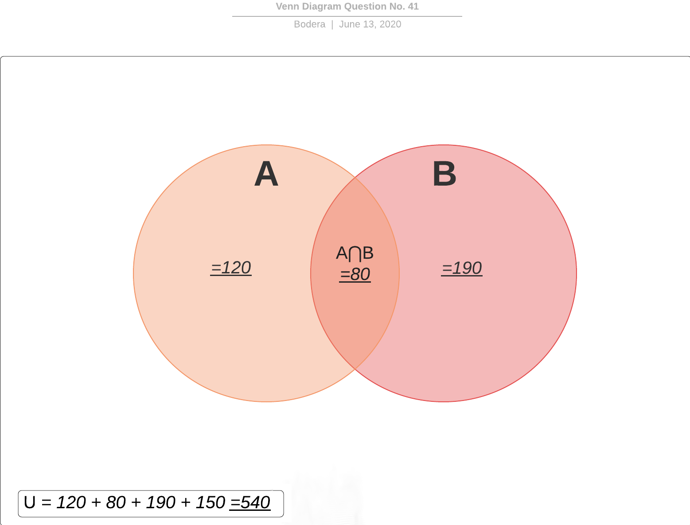

a) 380  
b) 430  
c) 480  
d) 540  
e) 610  

__Answer__:

Letter __D__ is correct.

### Question No. 42

In one school, 5000 students signed up to take subjects A and B. Of these students, 2825 enrolled in subject A and 1027 in subject B. Due to lack of academic conditions, 1324 students were unable to enroll in any of the subjects. The number of students enrolled in both subjects, simultaneously, is?

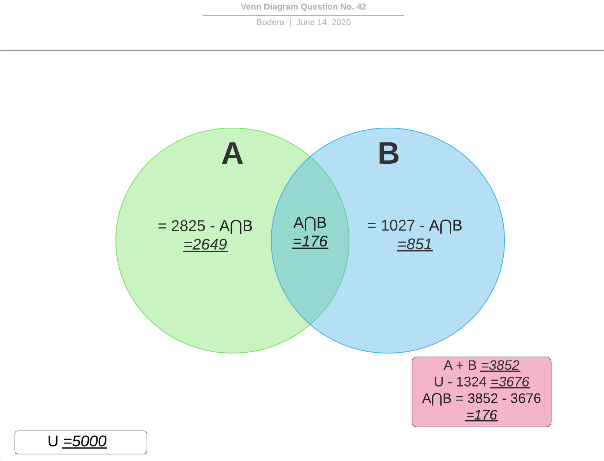

a) 156  
b) 176  
c) 297  
d) 1027  

__Answer__:

Letter __B__ is correct.

### Question No. 43

In a school there are *n* students. It is known that 56 students read newspaper A, 21 students read newspapers A and B, 106 read only one of the two newspapers and 66 do not read newspaper B. The value of *n* is?


a) 249  
b) 137  
c) 158  
d) 127  

__Answer__:

Letter __C__ is correct.

### Question No. 44

In a group of 30 people, 21 study French, 14 study English, while 3 study neither French nor English. What is the number of people studying both languages?

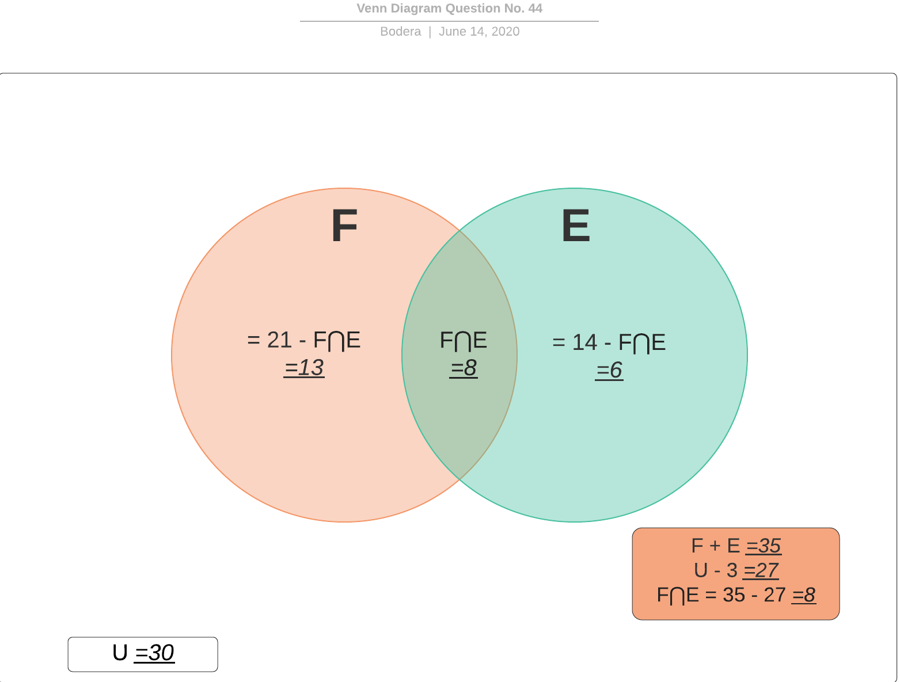

a) 3  
b) 4  
c) 6  
d) 8  

__Answer__:

Letter __D__ is correct.

### Question No. 45

In a school 30% of students speak English and 90% speak French. What percentage of students speak both languages?

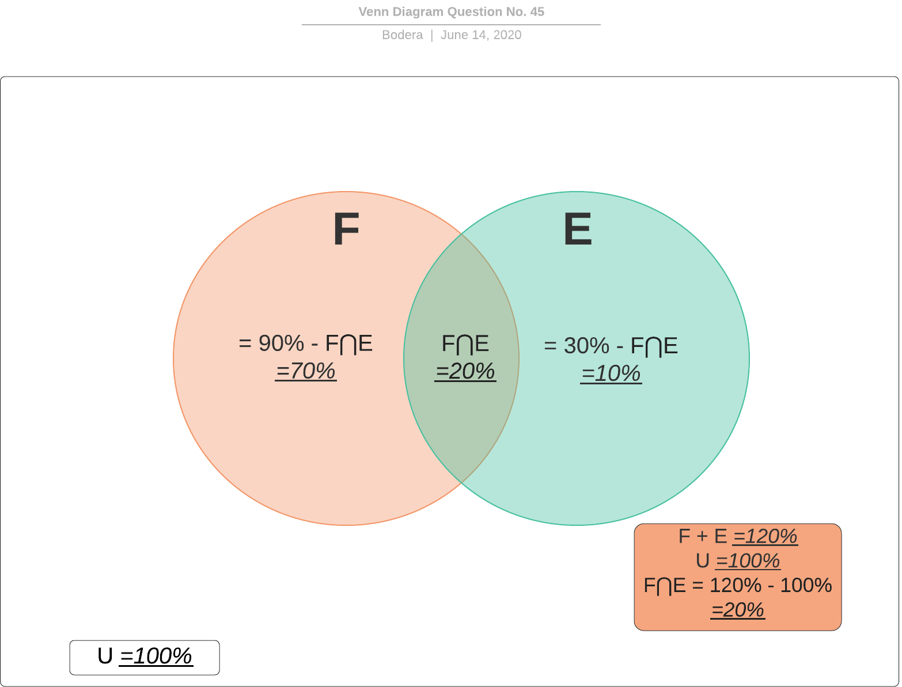

a) 40%  
b) 10%  
c) 20%  
d) 60%  

__Answer__:

Letter __C__ is correct.

### Question No. 46

In a group of 30 people, 5 are tall and fat, 11 are short and 13 are fat. The number of people in this set who are both tall and thin is?

|           | Tall | Short | __TOTAL__ |
|:---------:|:----:|:-----:|:---------:|
|    Fat    |   5  |   8   |     13    |
|    Thin   |  14  |   3   |     17    |
| __TOTAL__ |  19  |   11  |     30    |

a) 3  
b) 8  
c) 14  
d) 16  

__Answer__:

Letter __C__ is correct.

### Question No. 47

At a university, 1500 students study in the various courses offered. Of these, 35 are studying Electrical Engineering, 30 are studying Civil Engineering and 8 are studying both. The number of university students who do not study in either course is?

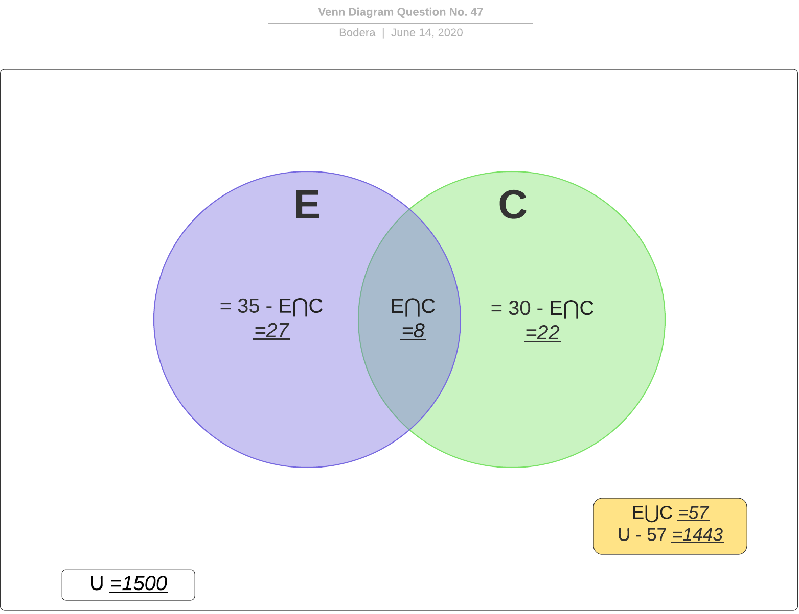

a) 1450  
b) 1435  
c) 1443  
d) 1427  
e) 1400  

__Answer__:

Letter __C__ is correct.

### Question No. 48

A company carried out, in a community, a survey on the consumption of three products A, B and C, manufactured by it. Below the tabulated data:

- A → 720 people  
- B → 650 people  
- C → 630 people  
- A e B → 200 people  
- A e C → 310 people  
- B e C → 350 people  
- A, B e C → 160 people  
- Nenhum dos três → 100 people  

Under these conditions, how many people were consulted?

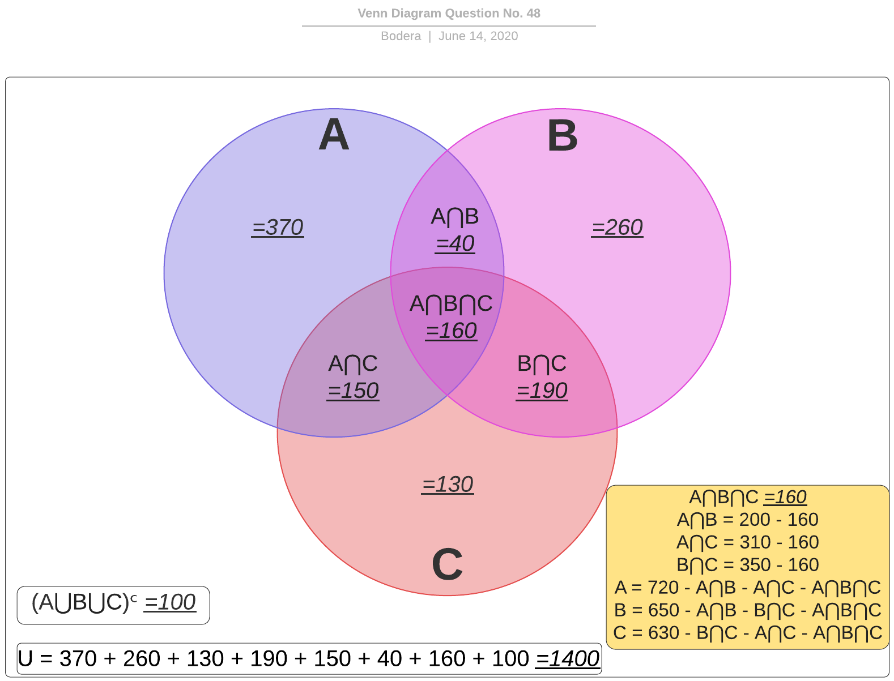

a) 1300  
b) 1040  
c) 1400  
d) 1200  
e) 1240  

__Answer__:

Letter __C__ is correct.

### Question No. 49

In the ABO blood group system, individuals may contain antigen A only, antigen B only, both antigens, or none of the antigens. In a survey, 6000 people were evaluated, of which 2500 had antigen A, 2200 had antigen B, and 1800 had none of the antigens. How many people presented both antigens?

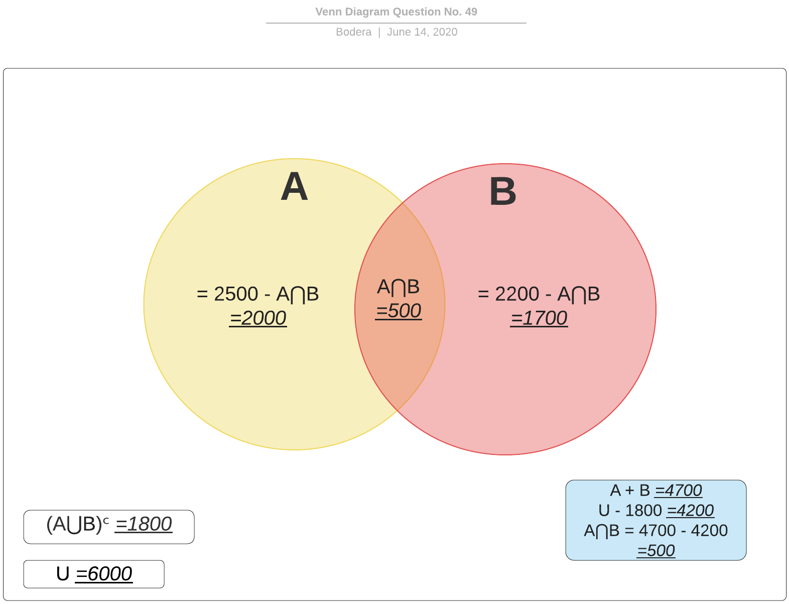

a) 500  
b) 0  
c) 2350  
d) 1500  
e) 4700  

__Answer__:

Letter __A__ is correct.

### Question No. 50

In an opinion poll, these data were obtained:

- 40% of respondents read newspaper A  
- 55% of respondents read newspaper B  
- 35% of respondents read newspaper C  
- 12% of respondents read A and B  
- 15% of respondents read A and C  
- 19% of respondents read B and C  
- 7% of respondents read the three newspapers  
- 135 people interviewed do not read any of the three newspapers  

Considering these data, is it CORRECT to state that the number of respondents was?

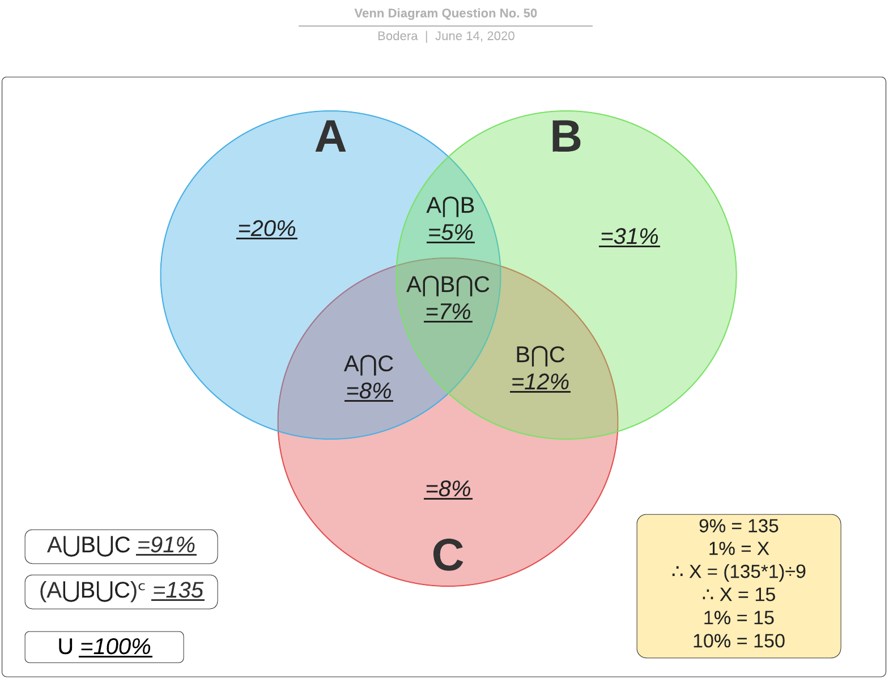

a) 1200  
b) 1250  
c) 1500  
d) 1350  

__Answer__:

Letter __C__ is correct.

### Question No. 51

In a society there are:

- 35 men
- 18 people wearing glasses
- 15 women who do not wear glasses
- 7 men who wear glasses

What is the number of people that make up this society?

|                     | Men | Women | __TOTAL__ |
|:-------------------:|:---:|:-----:|:---------:|
|     Wear glasses    |  7  |   11  |     18    |
| Do not wear glasses |  28 |   15  |     43    |
|      __TOTAL__      |  35 |   26  |     61    |

a) 26  
b) 35  
c) 40  
d) 46  
e) 61  

__Answer__:

Letter __E__ is correct.

### Question No. 52

In a classroom with 60 students, 11 play chess, 31 are men or play chess and 3 women play chess. It is concluded, therefore, that:

|                   | Men | Women | __TOTAL__ |
|:-----------------:|:---:|:-----:|:---------:|
|     Play chess    |  8  |   3   |     11    |
| Do not play chess |  20 |   29  |     49    |
|     __TOTAL__     |  28 |   32  |     60    |

a) 31 are women  
b) 29 are men  
c) 29 women do not play chess  
d) 23 men do not play chess  
e) 9 men play chess  

__Answer__:

Letter __C__ is correct.
