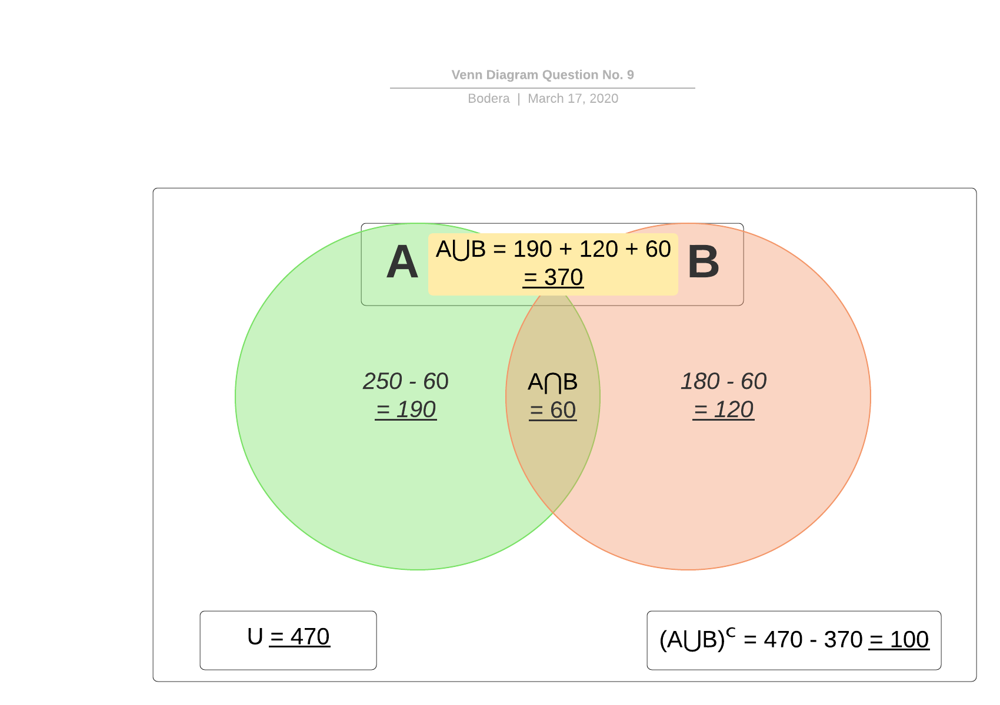
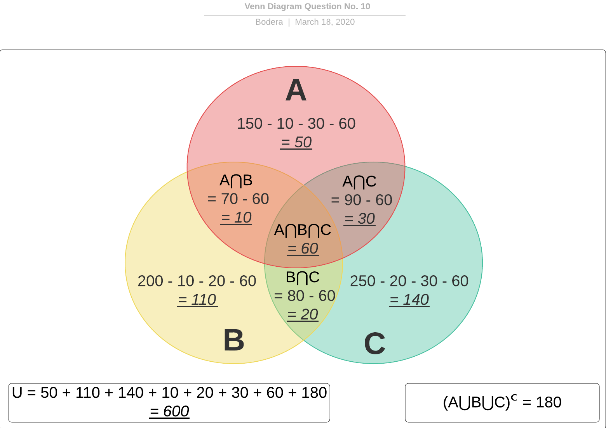
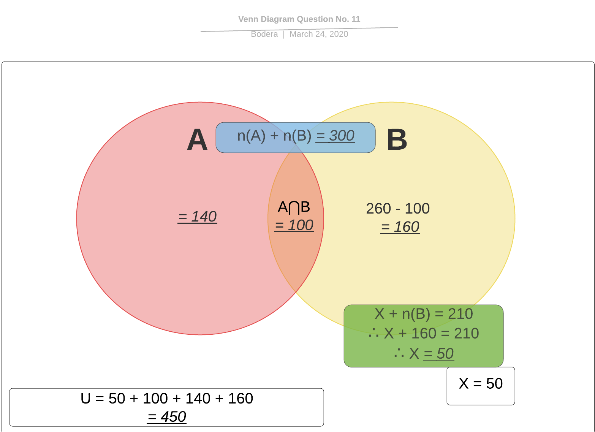
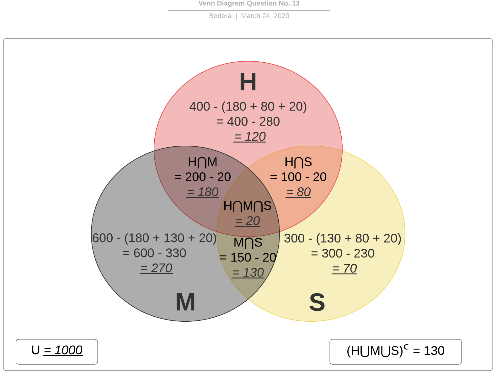

# Solving exercises

You may want to check out [this pdf file](./teoria-dos-conjuntos1.pdf) in order to read more about set theory and the needed properties to perform operations between them.

The __bold text__ will be used to denote a problem which solution will be achieved using formulas. The *italic text* will be used to denote a problem which solution will be achieved using the [Venn diagram](https://www.mathsisfun.com/sets/venn-diagrams.html), in this case the [lucid chart tool](https://www.lucidchart.com/pages/pt/exemplos/diagrama-de-venn-online) will be used to plot the diagrams.

## Exercises

### Question No. 1

Being the sets:
```
  A = {0, 3, 7}
  B = {0, 3, 5}
```  
Using the symbols ∈ and ∉, list:

a) (∈) 3 and A - 3 belongs to A  
b) (∉) 1 and B - 1 does not belong to B  
c) (∈) 3 and B - 3 belongs to B  
d) (∈) 0 and A - 0 belongs to A  
e) (∉) 5 and A - 5 does not belong to A  
f) (∈) 7 and A - 7 belongs to A  
g) (∉) 7 and B - 7 does not belong to B  
h) (∉) 2 and B - 2 does not belong to B  

### Question No. 2

Consider the sets
```
  A = {1, 2}
  B = {1, 2, 3}
  C = {1, 2, 3, 7, 8}
  D = {3, 7}
```  
Using the symbols ⊂ and ⊄, relate the sets to each other:

a) (⊂) A and B - A is contained in B  
b) (⊂) A and C - A is contained in C  
c) (⊄) A and D - A not contained in D  
d) (⊂) B and C - B is contained in C  
e) (⊄) D and A - D not contained in A  
f) (⊄) D and B - D not contained in B  
g) (⊂) D and C - D is contained in C  

### Question No. 3

In the diagram below, A, B and C are three non-empty sets. Check `T` or `F` for each of the sentences, depending on whether it is true or false:


a) (T) A ⊂ C - A is contained in C  
b) (T) B ⊂ C - B is contained in C  
c) (F) C ⊂ A - C is contained in A  
d) (F) A ⊂ B - A is contained in B  
e) (T) C ⊄ A - C not contained in A  
f) (T) A ⊄ B - A is contained in B  
g) (T) C ⊃ A - C contains A  
h) (T) A ⊅ C - A does not contain C  
i) (F) B ⊃ C - B contains C  
j) (F) C ⊂ B - C is contained in B  

### Question No. 4

Given the set:
```
  A = {0, 1, 2, {3}}
```  
Say whether the following propositions are true (T) or false (F):

a) (T) 0 ∈ A - 0 belongs to A  
b) (F) 1 ⊂ A - 1 is contained in A  
c) (T) {3} ∈ A - {3} belongs to A  
d) (F) {3} ⊂ A - {3} is contained in A  
e) (T) {1, 2} ⊂ A - {1, 2} is contained in A  
f) (T) ∅ ⊂ A - ∅ is contained in A  
g) (F) ∅ ∈ A - ∅ belongs to A  
h) (F) 3 ∈ A - 3 belongs to A  
i) (F) {3} ∉ A - {3} does not belong to A  
j) (F) 0 ⊂ A - 0 is contained in A  

### Question No. 5

Given the sets:
```
  A = {0, 1, 2, 3}
  B = {0, 2, 3, 5}
  C = {0, 2, 4, 6, 8}
  D = {5, 7, 9}
```  
determine:

a) A ∪ B  
```
  A ∪ B = {0, 1, 2, 3, 5}
```  

b) A ∪ C  
```
  A ∪ C = {0, 1, 2, 3, 4, 6, 8}
```  

c) A ∪ D  
```
  A ∪ D = {0, 1, 2, 3, 5, 7, 9}
```  

d) B ∪ C  
```
  B ∪ C = {0, 2, 3, 4, 5, 6, 8}
```  

e) B ∪ D  
```
  B ∪ D = {0, 2, 3, 5, 7, 9}
```  

f) C ∪ D  
```
  C ∪ D = {0, 2, 4, 5, 6, 7, 8, 9}
```  

g) (A ∪ B) ∪ C  
```
  (A ∪ B) ∪ C = {0, 1, 2, 3, 4, 5, 6, 8}
```  

h) (B ∪ C) ∪ D  
```
  (B ∪ C) ∪ D = {0, 2, 3, 4, 5, 6, 7, 8, 9}
```  

i) (A ∪ C) ∪ D  
```
  (A ∪ C) ∪ D = {0, 1, 2, 3, 4, 5, 6, 7, 8, 9}
```  

j) (B ∪ D) ∪ A  
```
  (B ∪ D) ∪ A = {0, 1, 2, 3, 5, 7, 9}
```  

### Question No. 6

With the same set:
```
  A = {0, 1, 2, 3}
  B = {0, 2, 3, 5}
  C = {0, 2, 4, 6, 8}
  D = {5, 7, 9}
```  
determine:

a) A ∩ B  
```
  A ∩ B = {0, 2, 3}
```  

b) A ∩ C  
```
  A ∩ C = {0, 2}
```  

c) A ∩ D  
```
  A ∩ D = {∅}
```  

d) B ∩ C  
```
  B ∩ C = {0, 2}
```  

e) B ∩ D  
```
  B ∩ D = {5}
```  

f) C ∩ D  
```
  C ∩ D = {∅}
```  

g) (A ∩ B) ∩ C  
```
  (A ∩ B) ∩ C = {0, 2}
```  

h) (B ∩ C) ∩ D  
```
  (B ∩ C) ∩ D = {∅}
```  

i) (A ∩ C) ∩ D  
```
  (A ∩ C) ∩ D = {∅}
```  

j) (B ∩ D) ∩ A  
```
  (B ∩ D) ∩ A = {∅}
```  

### Question No. 7

With the same set:
```
  A = {0, 1, 2, 3}
  B = {0, 2, 3, 5}
  C = {0, 2, 4, 6, 8}
  D = {5, 7, 9}
```  
determine:

a) A − B  
```
  A - B = {1}
```  

b) A − C  
```
  A - C = {1, 3}
```  

c) A − D  
```
  A - D = {0, 1, 2, 3}
```  

d) B − C  
```
  B - C = {3, 5}
```  

e) B − D  
```
  B - D = {0, 2, 3}
```  

f) C − D  
```
  C − D = {0, 2, 4, 6, 8}
```  

g) (A − B) − C  
```
  (A − B) − C = {1}
```  

h) (B − C) − D  
```
  (B − C) − D = {3}
```  

i) (A − C) − D  
```
  (A − C) − D = {1, 3}
```  

j) (B − D) − A  
```
  (B − D) − A = {∅}
```  

### Question No. 8

Consider the sets:
```
  A = {0, 1, 2, 3, 4, 5, 6, 7}
  B = {0, 2, 5}
  C = {1, 3, 5, 7}
  D = {2, 4, 6}
```  
determine:

a) Complementary of B in A  
```
  B - A = {1, 3, 4, 6, 7}
```

b) Complementary of C in A  
```
  C - A = {0, 2, 4, 6}
```

c) Complementary of D in A  
```
  D - A = {0, 1, 3, 5, 7}
```

d) Complementary of (B ∩ C ∩ D) in A  
```
  (B ∩ C ∩ D) - A = {0, 1, 2, 3, 4, 5, 6, 7}
```

### Question No. 9

In a research on preference over two newspapers, 470 people were consulted and the result was as follows: 250 of them read the newspaper A, 180 read newspaper B and 60 read both newspapers.
The following questions are asked:



a) How many people read only newspaper A?  
```
190
```
b) How many people read only newspaper B?  
```
120
```
c) How many people read newspapers?  
```
370
```
d) How many people do not read newspapers?  
```
100
```

### Question No. 10

In a city, three products A, B and C are consumed. A market survey was conducted on the consumption of these products and the following result was obtained:

|      Product      | Number of consumers |
|:-----------------:|:-------------------:|
|         A         |         150         |
|         B         |         200         |
|         C         |         250         |
|      A and B      |          70         |
|      A and C      |          90         |
|      B and C      |          80         |
|     A, B and C    |          60         |
| None of the three |         180         |

The following questions are asked:



a) How many people consume only product A?  
```
50
```
b) How many people consume product A or product B or product C?  
```
(A + B + C) + (A ∩ B) + (B ∩ C) + (A ∩ C) + (A ∩ B ∩ C)
= 300 + (10 + 20 + 30 + 60)
= 300 + 120
= 420
```
c) How many people consume product A or product B?  
```
(A + B) + (A ∩ B) + (B ∩ C) + (A ∩ C) + (A ∩ B ∩ C)
= 160 + (10 + 20 + 30 + 60)
= 160 + 120
= 280
```
d) How many people were consulted?  
```
600
```

### Question No. 11

A test was made up of two problems. 300 students hit only one, 260 hit the second, 100 students hit both and 210 missed the first. How many students took the test?



__Answer:__  
```
450 students took the test.
```

### Question No. 12

According to the theory, a set with m elements has exactly 2ᵐ subsets. Using this reasoning, determine the number of elements in set A, knowing that:

1. B is a set of three elements;  
2. A ∩ B is empty;  
3. The number of subsets of A ∪ B is 32.  

__Answer:__  
```
1 => P(B) = 2³ => 8
2 => A ∩ B = {∅}
3 => A ∪ B = P(32) => A ∪ 3 = 2⁵ => 2 ∪ 3 = 5

A is a set of two elements.
```

### Question No. 13

A publisher is studying the possibility of launching the publications HELENA, SENHORA and A MORENINHA again. For this, it carried out a market research and concluded that for every 1,000 people consulted, 600 read MORENINHA, 400 read HELENA, 300 read LADY, 200 read MORENINHA and HELENA, 150 read MORENINHA and LADY, 100 read HELENA and LADY and 20 read the three works.
It is questioned:



a) How many people read only one of the three works?  
```
(H ∪ M ∪ S) = 270 + 120 + 70 = 460
```
b) How many people have not read any of the three works?  
```
Complementary of (H ∪ M ∪ S) = 130
```
c) How many people read two or more works?  
```
(H ∩ S) + (M ∩ S) + (H ∩ M) + (H ∩ S ∩ M) = 80 + 130 + 180 + 20 = 410
```
