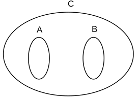

# Solving exercises

You may want to check out [this pdf file](./teoria-dos-conjuntos1.pdf) in order to read more about set theory and the needed properties to perform operations between them.

The __bold text__ will be used to denote a problem which solution will be achieved using formulas. The *italic text* will be used to denote a problem which solution will be achieved using the [Venn diagram](https://www.mathsisfun.com/sets/venn-diagrams.html), in this case the [meta-chart tool](https://www.meta-chart.com/venn#/) will be used to plot the diagrams.

## Exercises

### Question No. 1

Being the sets:
```
  A = {0, 3, 7}
  B = {0, 3, 5}
```  
Using the symbols ∈ and ∉, list:

a) (∈) 3 and A - 3 belongs to A  
b) (∉) 1 and B - 1 does not belong to B  
c) (∈) 3 and B - 3 belongs to B  
d) (∈) 0 and A - 0 belongs to A  
e) (∉) 5 and A - 5 does not belong to A  
f) (∈) 7 and A - 7 belongs to A  
g) (∉) 7 and B - 7 does not belong to B  
h) (∉) 2 and B - 2 does not belong to B  

### Question No. 2

Consider the sets
```
  A = {1, 2}
  B = {1, 2, 3}
  C = {1, 2, 3, 7, 8}
  D = {3, 7}
```  
Using the symbols ⊂ and ⊄, relate the sets to each other:

a) (⊂) A and B - A is contained in B  
b) (⊂) A and C - A is contained in C  
c) (⊄) A and D - A not contained in D  
d) (⊂) B and C - B is contained in C  
e) (⊄) D and A - D not contained in A  
f) (⊄) D and B - D not contained in B  
g) (⊂) D and C - D is contained in C  

### Question No. 3

In the diagram below, A, B and C are three non-empty sets. Check `T` or `F` for each of the sentences, depending on whether it is true or false:



a) (T) A ⊂ C - A is contained in C  
b) (T) B ⊂ C - B is contained in C  
c) (F) C ⊂ A - C is contained in A  
d) (F) A ⊂ B - A is contained in B  
e) (T) C ⊄ A - C not contained in A  
f) (T) A ⊄ B - A is contained in B  
g) (T) C ⊃ A - C contains A  
h) (T) A ⊅ C - A does not contain C  
i) (F) B ⊃ C - B contains C  
j) (F) C ⊂ B - C is contained in B  

### Question No. 4

Given the set:
```
  A = {0, 1, 2, {3}}
```  
Say whether the following propositions are true (T) or false (F):

a) (T) 0 ∈ A - 0 belongs to A  
b) (F) 1 ⊂ A - 1 is contained in A  
c) (T) {3} ∈ A - {3} belongs to A  
d) (F) {3} ⊂ A - {3} is contained in A  
e) (T) {1, 2} ⊂ A - {1, 2} is contained in A  
f) (T) ∅ ⊂ A - ∅ is contained in A  
g) (F) ∅ ∈ A - ∅ belongs to A  
h) (F) 3 ∈ A - 3 belongs to A  
i) (F) {3} ∉ A - {3} does not belong to A  
j) (F) 0 ⊂ A - 0 is contained in A  

### Question No. 5

Given the sets:
```
  A = {0, 1, 2, 3}
  B = {0, 2, 3, 5}
  C = {0, 2, 4, 6, 8}
  D = {5, 7, 9}
```  
determine:

a) A ∪ B  
```
  A ∪ B = {0, 1, 2, 3, 5}
```  

b) A ∪ C  
```
  A ∪ C = {0, 1, 2, 3, 4, 6, 8}
```  

c) A ∪ D  
```
  A ∪ D = {0, 1, 2, 3, 5, 7, 9}
```  

d) B ∪ C  
```
  B ∪ C = {0, 2, 3, 4, 5, 6, 8}
```  

e) B ∪ D  
```
  B ∪ D = {0, 2, 3, 5, 7, 9}
```  

f) C ∪ D  
```
  C ∪ D = {0, 2, 4, 5, 6, 7, 8, 9}
```  

g) (A ∪ B) ∪ C  
```
  (A ∪ B) ∪ C = {0, 1, 2, 3, 4, 5, 6, 8}
```  

h) (B ∪ C) ∪ D  
```
  (B ∪ C) ∪ D = {0, 2, 3, 4, 5, 6, 7, 8, 9}
```  

i) (A ∪ C) ∪ D  
```
  (A ∪ C) ∪ D = {0, 1, 2, 3, 4, 6, 7, 8, 9}
```  

j) (B ∪ D) ∪ A  
```
  (B ∪ D) ∪ A = {0, 1, 2, 3, 5, 7, 9}
```  

### Question No. 6

With the same set:
```
  A = {0, 1, 2, 3}
  B = {0, 2, 3, 5}
  C = {0, 2, 4, 6, 8}
  D = {5, 7, 9}
```  
determine:

a) A ∩ B  
```
  A ∩ B = {0, 2, 3}
```  

b) A ∩ C  
```
  A ∩ C = {0, 2}
```  

c) A ∩ D  
```
  A ∩ D = {∅}
```  

d) B ∩ C  
```
  B ∩ C = {0, 2}
```  

e) B ∩ D  
```
  B ∩ D = {∅}
```  

f) C ∩ D  
```
  C ∩ D = {∅}
```  

g) (A ∩ B) ∩ C  
```
  (A ∩ B) ∩ C = {0, 2}
```  

h) (B ∩ C) ∩ D  
```
  (B ∩ C) ∩ D = {∅}
```  

i) (A ∩ C) ∩ D  
```
  (A ∩ C) ∩ D = {∅}
```  

j) (B ∩ D) ∩ A  
```
  (B ∩ D) ∩ A = {∅}
```  

### Question No. 7

With the same set:
```
  A = {0, 1, 2, 3}
  B = {0, 2, 3, 5}
  C = {0, 2, 4, 6, 8}
  D = {5, 7, 9}
```  
determine:

a) A − B  
```
  A - B = {1}
```  

b) A − C  
```
  A - C = {1, 3}
```  

c) A − D  
```
  A - D = {0, 1, 2, 3}
```  

d) B − C  
```
  B - C = {3, 5}
```  

e) B − D  
```
  B - D = {0, 2, 3, 5}
```  

f) C − D  
```
  C − D = {0, 2, 4, 6, 8}
```  

g) (A − B) − C  
```
  (A − B) − C = {1}
```  

h) (B − C) − D  
```
  (B − C) − D = {3}
```  

i) (A − C) − D  
```
  (A − C) − D = {1, 3}
```  

j) (B − D) − A  
```
  (B − D) − A = {5}
```  

### Question No. 8

Consider the sets:
```
  A = {0, 1, 2, 3, 4, 5, 6, 7}
  B = {0, 2, 5}
  C = {1, 3, 5, 7}
  D = {2, 4, 6}
```  
determine:

a) Complementary of B in A  
```
  B - A = {1, 3, 4, 6, 7}
```

b) Complementary of C in A  
```
  C - A = {0, 2, 4, 6}
```

c) Complementary of D in A  
```
  D - A = {0, 1, 3, 5, 7}
```

d) Complementary of (B ∩ C ∩ D) in A  
```
  (B ∩ C ∩ D) - A = {0, 1, 2, 3, 4, 5, 6, 7}
```
