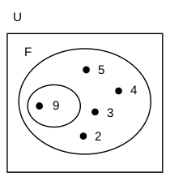

# Solving exercises

You may want to check out [this pdf file](./teoria-dos-conjuntos1.pdf) in order to read more about set theory and the needed properties to perform operations between them.

The __bold text__ will be used to denote a problem which solution will be achieved using formulas. The *italic text* will be used to denote a problem which solution will be achieved using the [Venn diagram](https://www.mathsisfun.com/sets/venn-diagrams.html), in this case the [lucid chart tool](https://www.lucidchart.com/pages/pt/exemplos/diagrama-de-venn-online) will be used to plot the diagrams.

## Exercises

1. [Question No. 1](https://github.com/Bodera/learnPath_Mathematics/blob/master/discrete-math/set-theory-solved.md#question-no-1)
2. [Question No. 2](https://github.com/Bodera/learnPath_Mathematics/blob/master/discrete-math/set-theory-solved.md#question-no-2)
3. [Question No. 3](https://github.com/Bodera/learnPath_Mathematics/blob/master/discrete-math/set-theory-solved.md#question-no-3)
4. [Question No. 4](https://github.com/Bodera/learnPath_Mathematics/blob/master/discrete-math/set-theory-solved.md#question-no-4)
5. [Question No. 5](https://github.com/Bodera/learnPath_Mathematics/blob/master/discrete-math/set-theory-solved.md#question-no-5)
6. [Question No. 6](https://github.com/Bodera/learnPath_Mathematics/blob/master/discrete-math/set-theory-solved.md#question-no-6)
7. [Question No. 7](https://github.com/Bodera/learnPath_Mathematics/blob/master/discrete-math/set-theory-solved.md#question-no-7)
8. [Question No. 8](https://github.com/Bodera/learnPath_Mathematics/blob/master/discrete-math/set-theory-solved.md#question-no-8)
9. [Question No. 9](https://github.com/Bodera/learnPath_Mathematics/blob/master/discrete-math/set-theory-solved.md#question-no-9)
10. [Question No. 10](https://github.com/Bodera/learnPath_Mathematics/blob/master/discrete-math/set-theory-solved.md#question-no-10)
11. [Question No. 11](https://github.com/Bodera/learnPath_Mathematics/blob/master/discrete-math/set-theory-solved.md#question-no-11)
12. [Question No. 12](https://github.com/Bodera/learnPath_Mathematics/blob/master/discrete-math/set-theory-solved.md#question-no-12)
13. [Question No. 13](https://github.com/Bodera/learnPath_Mathematics/blob/master/discrete-math/set-theory-solved.md#question-no-13)
14. [Question No. 14](https://github.com/Bodera/learnPath_Mathematics/blob/master/discrete-math/set-theory-solved.md#question-no-14)
15. [Question No. 15](https://github.com/Bodera/learnPath_Mathematics/blob/master/discrete-math/set-theory-solved.md#question-no-15)
16. [Question No. 16](https://github.com/Bodera/learnPath_Mathematics/blob/master/discrete-math/set-theory-solved.md#question-no-16)
17. [Question No. 17](https://github.com/Bodera/learnPath_Mathematics/blob/master/discrete-math/set-theory-solved.md#question-no-17)
18. [Question No. 18](https://github.com/Bodera/learnPath_Mathematics/blob/master/discrete-math/set-theory-solved.md#question-no-18)
19. [Question No. 19](https://github.com/Bodera/learnPath_Mathematics/blob/master/discrete-math/set-theory-solved.md#question-no-19)
20. [Question No. 20](https://github.com/Bodera/learnPath_Mathematics/blob/master/discrete-math/set-theory-solved.md#question-no-20)
21. [Question No. 21](https://github.com/Bodera/learnPath_Mathematics/blob/master/discrete-math/set-theory-solved.md#question-no-21)
22. [Question No. 22](https://github.com/Bodera/learnPath_Mathematics/blob/master/discrete-math/set-theory-solved.md#question-no-22)
23. [Question No. 23](https://github.com/Bodera/learnPath_Mathematics/blob/master/discrete-math/set-theory-solved.md#question-no-23)
24. [Question No. 24](https://github.com/Bodera/learnPath_Mathematics/blob/master/discrete-math/set-theory-solved.md#question-no-24)
25. [Question No. 25](https://github.com/Bodera/learnPath_Mathematics/blob/master/discrete-math/set-theory-solved.md#question-no-25)
26. [Question No. 26](https://github.com/Bodera/learnPath_Mathematics/blob/master/discrete-math/set-theory-solved.md#question-no-26)
27. [Question No. 27](https://github.com/Bodera/learnPath_Mathematics/blob/master/discrete-math/set-theory-solved.md#question-no-27)
28. [Question No. 28](https://github.com/Bodera/learnPath_Mathematics/blob/master/discrete-math/set-theory-solved.md#question-no-28)
29. [Question No. 29](https://github.com/Bodera/learnPath_Mathematics/blob/master/discrete-math/set-theory-solved.md#question-no-29)
30. [Question No. 30](https://github.com/Bodera/learnPath_Mathematics/blob/master/discrete-math/set-theory-solved.md#question-no-30)
31. [Question No. 31](https://github.com/Bodera/learnPath_Mathematics/blob/master/discrete-math/set-theory-solved.md#question-no-31)
32. [Question No. 32](https://github.com/Bodera/learnPath_Mathematics/blob/master/discrete-math/set-theory-solved.md#question-no-32)
33. [Question No. 33](https://github.com/Bodera/learnPath_Mathematics/blob/master/discrete-math/set-theory-solved.md#question-no-33)
34. [Question No. 34](https://github.com/Bodera/learnPath_Mathematics/blob/master/discrete-math/set-theory-solved.md#question-no-34)
35. [Question No. 35](https://github.com/Bodera/learnPath_Mathematics/blob/master/discrete-math/set-theory-solved.md#question-no-35)


### Question No. 1

Being the sets:
```
  A = {0, 3, 7}
  B = {0, 3, 5}
```  
Using the symbols ∈ and ∉, list:

a) (∈) 3 and A - 3 belongs to A  
b) (∉) 1 and B - 1 does not belong to B  
c) (∈) 3 and B - 3 belongs to B  
d) (∈) 0 and A - 0 belongs to A  
e) (∉) 5 and A - 5 does not belong to A  
f) (∈) 7 and A - 7 belongs to A  
g) (∉) 7 and B - 7 does not belong to B  
h) (∉) 2 and B - 2 does not belong to B  

### Question No. 2

Consider the sets
```
  A = {1, 2}
  B = {1, 2, 3}
  C = {1, 2, 3, 7, 8}
  D = {3, 7}
```  
Using the symbols ⊂ and ⊄, relate the sets to each other:

a) (⊂) A and B - A is contained in B  
b) (⊂) A and C - A is contained in C  
c) (⊄) A and D - A not contained in D  
d) (⊂) B and C - B is contained in C  
e) (⊄) D and A - D not contained in A  
f) (⊄) D and B - D not contained in B  
g) (⊂) D and C - D is contained in C  

### Question No. 3

In the diagram below, A, B and C are three non-empty sets. Check `T` or `F` for each of the sentences, depending on whether it is true or false:


a) (T) A ⊂ C - A is contained in C  
b) (T) B ⊂ C - B is contained in C  
c) (F) C ⊂ A - C is contained in A  
d) (F) A ⊂ B - A is contained in B  
e) (T) C ⊄ A - C not contained in A  
f) (T) A ⊄ B - A is contained in B  
g) (T) C ⊃ A - C contains A  
h) (T) A ⊅ C - A does not contain C  
i) (F) B ⊃ C - B contains C  
j) (F) C ⊂ B - C is contained in B  

### Question No. 4

Given the set:
```
  A = {0, 1, 2, {3}}
```  
Say whether the following propositions are true (T) or false (F):

a) (T) 0 ∈ A - 0 belongs to A  
b) (F) 1 ⊂ A - 1 is contained in A  
c) (T) {3} ∈ A - {3} belongs to A  
d) (F) {3} ⊂ A - {3} is contained in A  
e) (T) {1, 2} ⊂ A - {1, 2} is contained in A  
f) (T) ∅ ⊂ A - ∅ is contained in A  
g) (F) ∅ ∈ A - ∅ belongs to A  
h) (F) 3 ∈ A - 3 belongs to A  
i) (F) {3} ∉ A - {3} does not belong to A  
j) (F) 0 ⊂ A - 0 is contained in A  

### Question No. 5

Given the sets:
```
  A = {0, 1, 2, 3}
  B = {0, 2, 3, 5}
  C = {0, 2, 4, 6, 8}
  D = {5, 7, 9}
```  
determine:

a) A ∪ B  
```
  A ∪ B = {0, 1, 2, 3, 5}
```  

b) A ∪ C  
```
  A ∪ C = {0, 1, 2, 3, 4, 6, 8}
```  

c) A ∪ D  
```
  A ∪ D = {0, 1, 2, 3, 5, 7, 9}
```  

d) B ∪ C  
```
  B ∪ C = {0, 2, 3, 4, 5, 6, 8}
```  

e) B ∪ D  
```
  B ∪ D = {0, 2, 3, 5, 7, 9}
```  

f) C ∪ D  
```
  C ∪ D = {0, 2, 4, 5, 6, 7, 8, 9}
```  

g) (A ∪ B) ∪ C  
```
  (A ∪ B) ∪ C = {0, 1, 2, 3, 4, 5, 6, 8}
```  

h) (B ∪ C) ∪ D  
```
  (B ∪ C) ∪ D = {0, 2, 3, 4, 5, 6, 7, 8, 9}
```  

i) (A ∪ C) ∪ D  
```
  (A ∪ C) ∪ D = {0, 1, 2, 3, 4, 5, 6, 7, 8, 9}
```  

j) (B ∪ D) ∪ A  
```
  (B ∪ D) ∪ A = {0, 1, 2, 3, 5, 7, 9}
```  

### Question No. 6

With the same set:
```
  A = {0, 1, 2, 3}
  B = {0, 2, 3, 5}
  C = {0, 2, 4, 6, 8}
  D = {5, 7, 9}
```  
determine:

a) A ∩ B  
```
  A ∩ B = {0, 2, 3}
```  

b) A ∩ C  
```
  A ∩ C = {0, 2}
```  

c) A ∩ D  
```
  A ∩ D = {∅}
```  

d) B ∩ C  
```
  B ∩ C = {0, 2}
```  

e) B ∩ D  
```
  B ∩ D = {5}
```  

f) C ∩ D  
```
  C ∩ D = {∅}
```  

g) (A ∩ B) ∩ C  
```
  (A ∩ B) ∩ C = {0, 2}
```  

h) (B ∩ C) ∩ D  
```
  (B ∩ C) ∩ D = {∅}
```  

i) (A ∩ C) ∩ D  
```
  (A ∩ C) ∩ D = {∅}
```  

j) (B ∩ D) ∩ A  
```
  (B ∩ D) ∩ A = {∅}
```  

### Question No. 7

With the same set:
```
  A = {0, 1, 2, 3}
  B = {0, 2, 3, 5}
  C = {0, 2, 4, 6, 8}
  D = {5, 7, 9}
```  
determine:

a) A − B  
```
  A - B = {1}
```  

b) A − C  
```
  A - C = {1, 3}
```  

c) A − D  
```
  A - D = {0, 1, 2, 3}
```  

d) B − C  
```
  B - C = {3, 5}
```  

e) B − D  
```
  B - D = {0, 2, 3}
```  

f) C − D  
```
  C − D = {0, 2, 4, 6, 8}
```  

g) (A − B) − C  
```
  (A − B) − C = {1}
```  

h) (B − C) − D  
```
  (B − C) − D = {3}
```  

i) (A − C) − D  
```
  (A − C) − D = {1, 3}
```  

j) (B − D) − A  
```
  (B − D) − A = {∅}
```  

### Question No. 8

Consider the sets:
```
  A = {0, 1, 2, 3, 4, 5, 6, 7}
  B = {0, 2, 5}
  C = {1, 3, 5, 7}
  D = {2, 4, 6}
```  
determine:

a) Complementary of B in A  
```
  B - A = {1, 3, 4, 6, 7}
```

b) Complementary of C in A  
```
  C - A = {0, 2, 4, 6}
```

c) Complementary of D in A  
```
  D - A = {0, 1, 3, 5, 7}
```

d) Complementary of (B ∩ C ∩ D) in A  
```
  (B ∩ C ∩ D) - A = {0, 1, 2, 3, 4, 5, 6, 7}
```

### Question No. 9

In a research on preference over two newspapers, 470 people were consulted and the result was as follows: 250 of them read the newspaper A, 180 read newspaper B and 60 read both newspapers.
The following questions are asked:


a) How many people read only newspaper A?  
```
190
```
b) How many people read only newspaper B?  
```
120
```
c) How many people read newspapers?  
```
370
```
d) How many people do not read newspapers?  
```
100
```

### Question No. 10

In a city, three products A, B and C are consumed. A market survey was conducted on the consumption of these products and the following result was obtained:

|      Product      | Number of consumers |
|:-----------------:|:-------------------:|
|         A         |         150         |
|         B         |         200         |
|         C         |         250         |
|      A and B      |          70         |
|      A and C      |          90         |
|      B and C      |          80         |
|     A, B and C    |          60         |
| None of the three |         180         |

The following questions are asked:


a) How many people consume only product A?  
```
50
```
b) How many people consume product A or product B or product C?  
```
(A + B + C) + (A ∩ B) + (B ∩ C) + (A ∩ C) + (A ∩ B ∩ C)
= 300 + (10 + 20 + 30 + 60)
= 300 + 120
= 420
```
c) How many people consume product A or product B?  
```
(A + B) + (A ∩ B) + (B ∩ C) + (A ∩ C) + (A ∩ B ∩ C)
= 160 + (10 + 20 + 30 + 60)
= 160 + 120
= 280
```
d) How many people were consulted?  
```
600
```

### Question No. 11

A test was made up of two problems. 300 students hit only one, 260 hit the second, 100 students hit both and 210 missed the first. How many students took the test?


__Answer:__  
```
450 students took the test.
```

### Question No. 12

According to the theory, a set with m elements has exactly 2ᵐ subsets. Using this reasoning, determine the number of elements in set A, knowing that:

1. B is a set of three elements;  
2. A ∩ B is empty;  
3. The number of subsets of A ∪ B is 32.  

__Answer:__  
```
1 => P(B) = 2³ => 8
2 => A ∩ B = {∅}
3 => A ∪ B = P(32) => A ∪ 3 = 2⁵ => 2 ∪ 3 = 5

A is a set of two elements.
```

### Question No. 13

A publisher is studying the possibility of launching the publications HELENA, SENHORA and A MORENINHA again. For this, it carried out a market research and concluded that for every 1,000 people consulted, 600 read MORENINHA, 400 read HELENA, 300 read LADY, 200 read MORENINHA and HELENA, 150 read MORENINHA and LADY, 100 read HELENA and LADY and 20 read the three works.
It is questioned:


a) How many people read only one of the three works?  
```
(H ∪ M ∪ S)
= 270 + 120 + 70
= 460
```
b) How many people have not read any of the three works?  
```
Complementary of (H ∪ M ∪ S)
= 130
```
c) How many people read two or more works?  
```
(H ∩ S) + (M ∩ S) + (H ∩ M) + (H ∩ S ∩ M)
= 80 + 130 + 180 + 20
= 410
```

### Question No. 14
In a group of 99 athletes, 40 play volleyball, 20 play volleyball and basketball, 22 play basketball and football, 18 play volleyball and football, 11 play all three. The number of people who play basketball is equal to the number of people who play football.
It is questioned:


a) How many play football and do not play volleyball?  
```
F + (B ∩ F)
= 25 + 11
= 36
```
b) How many play basketball and do not play volleyball?  
```
B + (F ∩ B)
= 23 + 11
= 34
```
c) How many play volleyball and do not play basketball?  
```
V + (F ∩ V)
= 13 + 7
= 20
```

### Question No. 15

Given the diagram below, color the region (A ∩ B) ∪ (A ∩ C).


__Answer__:


### Question No. 16

__Answers__:
a) What is called the set that has only one element?  
```
Unitary.
```
b) If A ∩ B = ∅, what are the sets A and B called?  
```
Disjoint sets.
```
c) If a set A has 3 elements and a set B has 5 elements, how many elements does set A ∩ B will have at most?
```
3 elements.
```
d) If A and B are disjoint, how many elements will the set A ∩ B have?  
```
0, none. The intersection of disjoint sets is ∅.
```

### Question No. 17

In the sentences below, *T* is used to mark the true sentences and *F* the false ones.

a) {2} ∈ {0, 1, 2} - {2} belongs to {0, 1, 2}  
b) ∅ ⊂ {5, 6, 7} - *void* is contained in {5, 6, 7}  
c) ∅ ∈ {∅, 4} - *void* belongs to {∅, 4}  
d) 5 ∈ {3, {5, 1}, 4} - 5 belongs to {3, {5, 1}, 4}  
e) {5, 6} ⊃ {5, 6, 7} - {5, 6} contains {5, 6, 7}  

__Answers__:

a) __F__  
b) __T__  
c) __T__  
d) __F__  
e) __F__  

### Question No. 18

Which of the sentences below is true?

a) 0 = {0} - 0 is equals to {0}  
b) 0 ∈ ∅ - 0 belongs to *void*  
c) { } = ∅ - { } is equals to *void*  
d) {{ }} = ∅ - {{ }} is equals to *void*  

__Answers__:

Letter __C__ is true.

### Question No. 19

Being A = {1, 2, {1}, {2, 3}}, which of the propositions below is false?

a) 1 ∈ A - 1 belongs to A  
b) {3} ∈ A - {3} belongs to A  
c) {1} ∈ A - {1} belongs to A  
d) A has four elements in total  

__Answers__:

Letter __B__ is false.

### Question No. 20

Given the set A = {1, {2}, 2}, which of the relationships below is false?

a) {2} ∈ A - {2} belongs to A  
b) {1} ∈ A - {1} belongs to A  
c) {1, 2} ⊂ A - {1, 2} is contained in A  
d) {2} ⊂ A - {2} is contained in A  
e) {2, {2}} ⊂ A - {2, {2}} is contained in A  

__Answers__:

Letter __B__ is false.

### Question No. 21

Given the set A = {3, {3}}, and the propositions:

I. 3 ∈ A  
II. {3} ⊂ A  
III. {3} ∈ A  

So which of them are true?

__Answer__:

All propositions are true.

### Question No. 22

If A = {∅, 3, {3}, {2, 3}}, so:

a) {2, 3} ⊂ A - {2, 3} is contained in A  
b) 2 ∈ A - 2 belongs to A  
c) ∅ ∉ A - *void* does not belong to A  
d) 3 ⊂ A - 3 is contained in A  
e) {3} ∈ A - {3} belongs to A  

__Answer__:

Letter __E__ is correct.

### Question No. 23

In the diagram below, we have that:



a) 3 ∈ P(F) - 3 belongs to a part of F  
b) {4, 5} ⊂ P(F) - {4, 5} is contained in a part of F  
c) {3} ∉ P(F) - {3} does not belong to a part of F  
d) {2, 3} ⊂ P(F) - {2, 3} is contained in a part of F  
e) {{9}} ∈ P(F) - {{9}} belongs to a part of F  

`Hint`
```
F has a total of 5 elements
F = {2, 3, 4, 5, {9}}
The total subsets that we can form from F is = 2⁵
2 ^ 5 = 32

a subset without elements: {∅}
a subset with a single element: {2}; {3}; {4}; {5}; {{9}}
a subset with two elements: {2, 3}; {2, 4}; {2, 5}; {2, {9}}; {3, 4};
                            {3, 5}; {3, {9}}; {4, 5}; {4, {9}}; {5, {9}}
a subset with three elements: {2, 3, 4}; {2, 3, 5}; {2, 3, {9}}; {2, 4, 5}; {2, 4, {9}}; {2, 5, {9}};
                              {2, 5, {9}}; {3, 4, 5}; {3, 4, {9}}; {3, 5, {9}}; {4, 5, {9}};
a subset with four elements: {2, 3, 4, 5}; {2, 3, 4, {9}}; {2, 4, 5, {9}}; {3, 4, 5, {9}};
a subset with five elements: {2, 3, 4, 5, {9}}
```

__Answer__:

Letter __E__ is correct.

### Question No. 24

Consider the following sets of natural numbers:

i. A = {x ∈ ℕ | 0 ≤ x ≤ 25}
ii. B = {x ∈ ℕ | 16 ≤ x < 25}

The number of elements in the set A ⋂ B is?

a) 9  
b) 10  
c) 11  
d) 12  

`Hint`
```
A ⋂ B = {16, 17, 18, 19, 20, 21, 22, 23, 24}

A total of 9 elements.
```

__Answer__:

Letter __A__ is correct.

### Question No. 25

Consider the following sets of natural numbers:

i. A = {x ∈ ℕ | 1 ≤ x ≤ 20}
ii. B = {x ∈ ℕ | 17 < x ≤ 25}

The number of subsets in A ⋂ B is equal to:

a) 3  
b) 4  
c) 6  
d) 8  

`Hint`
```
A ⋂ B has a total of 3 elements.
A ⋂ B = {18, 19, 20}
The total subsets that we can form from A ⋂ B is = 2³
2 ^ 3 = 8

a subset without elements: {∅}
a subset with a single element: {18}; {19}; {20}
a subset with two elements: {18, 19}; {18, 20}; {19, 20}
a subset with three elements: {18, 19, 20}
```

__Answer__:

Letter __D__ is correct.

### Question No. 26

Let A be a set with 8 elements. The number of subsets in A is?

a) 8  
b) 256  
c) 6  
d) 128  

`Hint`
```
A has a total of 8 elements.
A = {a, b, c, d, e, f, g, h}
The total subsets that we can form from A = 2⁸
2 ^ 8 = 256

a subset without elements: {∅}
a subset with a single element: {...}
a subset with two elements: {...}
a subset with three elements: {...}
a subset with four elements: {...}
a subset with five elements: {...}
a subset with six elements: {...}
a subset with seven elements: {...}
a subset with eight elements: {a, b, c, d, e, f, g, h}

We've already proved it.
```

__Answer__:

Letter __B__ is correct.

### Question No. 27

Given the set E = {1, 2, 4, 8}, does it have how many subsets?

a) 8  
b) 16  
c) 32  
d) 64  

`Hint`
```
E has a total of 4 elements.
The total subsets that we can form from A = 2⁴
2 ^ 4 = 16

a subset without elements: {∅}
a subset with a single element: {...}
a subset with two elements: {...}
a subset with three elements: {...}
a subset with four elements: {1, 2, 3, 4}

We've already proved it.
```

__Answers__:

Letter __B__ is correct.

### Question No. 28

What is the set of parts of the empty set?

a) ∅  
b) {∅}  
c) {∅, {∅}}  
d) {{∅}}  

`Hint`
```
∅ = {∅}
∅ has a total of 0 elements.
The total subsets that we can form from ∅ = 2⁰
2 ^ 0 = 1

a subset without elements: {∅}
```

__Answer__:

Letter __B__ is correct.

### Question No. 29

What is the set of parts of the set {∅}?

a) ∅  
b) {∅}  
c) {∅, {∅}}  
d) {{∅}}  

`Hint`
```
{∅} = {∅, {∅}}
{∅} has a total of 1 elements.
The total subsets that we can form from {∅} = 2¹
2 ^ 1 = 2

a subset without elements: {∅}
a subset with a single elements: {{∅}}
```

__Answer__:

Letter __C__ is correct.
