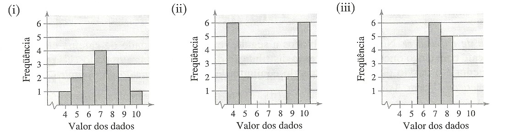
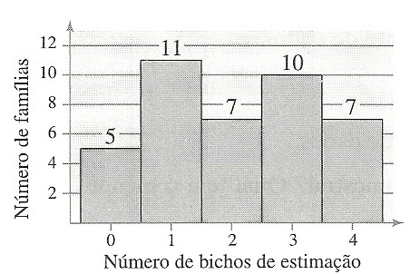
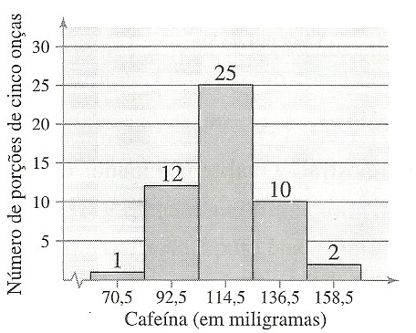
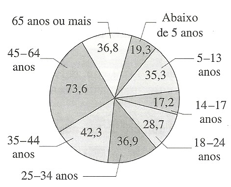
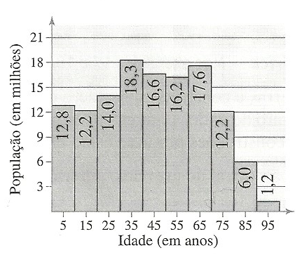

# Variations measures

## Summary

* [__Question No. 1__](https://github.com/Bodera/learnPath_Mathematics/blob/master/statistics/solved-list3.md#question-no-1)
* [__Question No. 2__](https://github.com/Bodera/learnPath_Mathematics/blob/master/statistics/solved-list3.md#question-no-2)
* [__Question No. 3__](https://github.com/Bodera/learnPath_Mathematics/blob/master/statistics/solved-list3.md#question-no-3)
* [__Question No. 4__](https://github.com/Bodera/learnPath_Mathematics/blob/master/statistics/solved-list3.md#question-no-4)
* [__Question No. 5__](https://github.com/Bodera/learnPath_Mathematics/blob/master/statistics/solved-list3.md#question-no-5)
* [__Question No. 6__](https://github.com/Bodera/learnPath_Mathematics/blob/master/statistics/solved-list3.md#question-no-6)
* [__Question No. 7__](https://github.com/Bodera/learnPath_Mathematics/blob/master/statistics/solved-list3.md#question-no-7)
* [__Question No. 8__](https://github.com/Bodera/learnPath_Mathematics/blob/master/statistics/solved-list3.md#question-no-8)
* [__Question No. 9__](https://github.com/Bodera/learnPath_Mathematics/blob/master/statistics/solved-list3.md#question-no-9)
* [__Question No. 10__](https://github.com/Bodera/learnPath_Mathematics/blob/master/statistics/solved-list3.md#question-no-10)
* [__Question No. 11__](https://github.com/Bodera/learnPath_Mathematics/blob/master/statistics/solved-list3.md#question-no-11)
* [__Question No. 12__](https://github.com/Bodera/learnPath_Mathematics/blob/master/statistics/solved-list3.md#question-no-12)
* [__Question No. 13__](https://github.com/Bodera/learnPath_Mathematics/blob/master/statistics/solved-list3.md#question-no-13)

### Question No. 1

Obtain the total amplitude, average, variance and standart deviation for the two data sets below:

```txt
Dataset 1:  11   10   8   4   6   7   11   6   11   7

Dataset 2:  15   8   12   5   19   14   8   6   13
```

#### Procedures for the solution of question No. 1

__1º step__ - Sort the data in ascending order.

```txt
Dataset 1:  4   6   6   7   7   8   10   11   11   11  

Dataset 2:  5   6   8   8   12   13   14   15   19
```

__2º step__ - Then calculate the total amplitude of each data set by subtracting the highest value from the lowest value.

```txt
Dataset 1:  (11) - (4)
            = 7 value of total amplitude

Dataset 2:  (19) - (5)
            = 14 value of total amplitude
```

__3º step__ - Calculate the arithmetic mean of each data set by applying the formula:

```txt
x̅ = (1/n) * (x₁ + ... + xₙ)
n: total of values in the data set
xₙ: each individual value in the data set
```

knowing this, arithmetic mean can now be calculate:

```txt
Dataset 1:  (1 / 10) * (4 + 6 + 6 + 7 + 7 + 8 + 10 + 11 + 11 + 11)
            = 0.1 * 81
            = 8.1 value of arithmetic mean

Dataset 2:  (1 / 9) * (5 + 6 + 8 + 8 + 12 + 13 + 14 + 15 + 19)
            = 0.111... * 100
            = 11.111... value of arithmetic mean
```

__4º step__ - Calculate the standart deviation of each data set by applying the formula:

```txt
s = √((1/(n-1)) * (xᵢ - x̅)²)
x̅: arithmetic average of data set
n: total of values in the data set
xᵢ: each individual value in the data set
```

knowing this, standart deviation can now be calculate:

```txt
Dataset 1:  √((1/(10-1)) * ((4 - 8.1)² + (6 - 8.1)² + (6 - 8.1)² + (7 - 8.1)² + (7 - 8.1)² +
                            (8 - 8.1)² + (10 - 8.1)² + (11 - 8.1)² + (11 - 8.1)² + (11 - 8.1)²))
            = √((1/9) * (16.81 + 4.41 + 4.41 + 1.21 + 1.21 + 0.01 + 3.61 + 8.41 + 8.41 + 8.41))
            = √(0.111... * 56.9)
            = √(6.3222...)
            = 2.5144 value of standart deviation

Dataset 2:  √((1/(9-1)) * ((5 - 11.111...)² + (6 - 11.111...)² + (8 - 11.111...)² +
                           (8 - 11.111...)² + (12 - 11.111...)² + (13 - 11.111...)² +
                           (14 - 11.111...)² + (15 - 11.111...)² + (19 - 11.111...)²))
            = √((1/8) * (37.34567765 + 26.12345565 + 9.679011654 + 9.679011654 + 0.7901236543 +
                         3.567901654 + 8.345679654 + 15.12345765 + 62.23456965))
            = √(0.125 * 172.889)
            = √(21.6111...)
            = 4.6487 value of standart deviation
```

__5º step__ - Calculate the variance of each data set by applying the formula:

```txt
s²
s: standart deviation
```

knowing this, standart deviation can now be calculate:

```txt
Dataset 1:  (2.514402955)²
            = 6.3222... value of variance

Dataset 2:  (4.648775227)²
            = 21.6111... value of variance
```

### Question No. 2

Samples of annual salaries, in thousands of dollars, from government officials in the city of Los Angeles and Long Beach are listed below:

```txt
Los Angeles: 20.2  26.1  20.9  35.9  23.0  28.2  31.6  18.3
Long Beach:  20.9  18.2  20.8  21.1  26.5  26.9  24.2  25.1
```

a) Obtain the total amplitude, average, variance and standart deviation for each of the data sets
b) Compare the two cities (average salary and standart deviation).

#### Procedures for the solution of question No. 2

__1º step__ - Sort the data in ascending order.

```txt
LA:   18.3  20.2  20.9  23.0  26.1  28.2  31.6  35.9
LBC:  18.2  20.8  20.9  21.1  24.2  25.1  26.5  26.9
```

__2º step__ - Then calculate the total amplitude of each data set by subtracting the highest value from the lowest value.

```txt
LA:  (35.9) - (18.3)
     = 17.6 value of total amplitude

LBC: (26.9) - (18.2)
     = 8.7 value of total amplitude
```

__3º step__ - Calculate the arithmetic mean of each data set by applying the formula:

```txt
x̅ = (1/n) * (x₁ + ... + xₙ)
n: total of values in the data set
xₙ: each individual value in the data set
```

knowing this, arithmetic mean can now be calculate:

```txt
LA: (1 / 8) * (18.3 + 20.2 + 20.9 + 23.0 + 26.1 + 28.2 + 31.6 + 35.9)
    = 0.125 * 204.2
    = 25.525 value of arithmetic mean

LBC: (1 / 8) * (18.2 + 20.8 + 20.9 + 21.1 + 24.2 + 25.1 + 26.5 + 26.9)
     = 0.125 * 183.7
     = 22.9625 value of arithmetic mean
```

__4º step__ - Calculate the standart deviation of each data set by applying the formula:

```txt
s = √((1/(n-1)) * (xᵢ - x̅)²)
x̅: arithmetic average of data set
n: total of values in the data set
xᵢ: each individual value in the data set
```

knowing this, standart deviation can now be calculate:

```txt
LA:  √((1/(8-1)) * ((18.3 - 25.525)² + (20.2 - 25.525)² + (20.9 - 25.525)² + (23.0 - 25.525)² +
                    (26.1 - 25.525)² + (28.2 - 25.525)² + (31.6 - 25.525)² + (35.9 - 25.525)²))
     = √((1/7) * (52.200625 + 28.355625 + 21.390625 + 6.375625 +
                  0.330625 + 7.155625 + 36.905625 + 107.640625))
     = √(0.1428571429 * 260.355)
     = √(37.19357144)
     = 6.0986 value of standart deviation

LBC: √((1/(8-1)) * ((18.2 - 22.9625)² + (20.8 - 22.9625)² + (20.9 - 22.9625)² + (21.1 - 22.9625)² +
                    (24.2 - 22.9625)² + (25.1 - 22.9625)² + (26.5 - 22.9625)² + (26.9 - 22.9625)²))
     = √((1/7) * (22.68140625 + 4.67640625 + 4.25390625 + 3.46890625 +
                  1.53140625 + 4.56890625 + 12.51390625 + 15.50390625))
     = √(0.1428571429 * 69.19875)
     = √(9.885535717)
     = 3.1441 value of standart deviation
```

__5º step__ - Calculate the variance of each data set by applying the formula:

```txt
s²
s: standart deviation
```

knowing this, standart deviation can now be calculate:

```txt
LA:  (6.098653248)²
     = 37.1935 value of variance

LBC: (3.144127179)²
     = 9.8855 value of variance
```

__6º step__ - Lets compare the arithmetic average and standart deviation of the two cities:

```txt
LA:  25.525 higher salary avg; 6.0986 higher standart deviation.

LBC: 22.9625 lower salary avg; 3.1441 lower standart deviation.

The annual wages of LA vary more than LBC.
```

### Question No. 3

Samples of annual salaries, in thousands of dollars, for teachers from public and private schools are listed below.

```txt
Public school:  38.6  38.1  38.7  36.8  34.8  35.9  39.9  36.2
Private school: 21.8  18.4  20.3  17.6  19.7  18.3  19.4  20.8
```

a) Obtain the total amplitude, average, variance and standart deviation for each of the data sets.
b) Compare the two education networks (average salary and standart deviation).

#### Procedures for the solution of question No. 3

__1º step__ - Sort the data in ascending order.

```txt
Public school:  34.8  35.9  36.2  36.8  38.1  38.6  38.7  39.9
Private school: 17.6  18.3  18.4  19.4  19.7  20.3  20.8  21.8
```

__2º step__ - Then calculate the total amplitude of each data set by subtracting the highest value from the lowest value.

```txt
Public school:  (39.9) - (34.8)
                = 5.1 value of total amplitude

Private school: (21.8) - (17.6)
                = 4.2 value of total amplitude
```

__3º step__ - Calculate the arithmetic mean of each data set by applying the formula:

```txt
x̅ = (1/n) * (x₁ + ... + xₙ)
n: total of values in the data set
xₙ: each individual value in the data set
```

knowing this, arithmetic mean can now be calculate:

```txt
Public school:  = (1/8) * (34.8 + 35.9 + 36.2 + 36.8 + 38.1 + 38.6 + 38.7 + 39.9)
                = 0.125 * 299
                = 37.375 value of arithmetic mean

Private school: = (1/8) * (17.6 + 18.3 + 18.4 + 19.4 + 19.7 + 20.3 + 20.8 + 21.8)
                = 0.125 * 156.3
                = 19.5375 value of arithmetic mean
```

__4º step__ - Calculate the standart deviation of each data set by applying the formula:

```txt
s = √((1/(n-1)) * (xᵢ - x̅)²)
x̅: arithmetic average of data set
n: total of values in the data set
xᵢ: each individual value in the data set
```

knowing this, standart deviation can now be calculate:

```txt
Public school:  √((1/(8-1)) * ((34.8 - 37.375)² + (35.9 - 37.375)² + (36.2 - 37.375)² + (36.8 - 37.375)² +
                               (38.1 - 37.375)² + (38.6 - 37.375)² + (38.7 - 37.375)² + (39.9 - 37.375)²))
                = √((1/7) * (6.630625 + 2.175625 + 1.380625 + 0.330625 +
                             0.525625 + 1.500625 + 1.755625 + 6.375625))
                = √(0.1428571429 * 20.675)
                = √(2.953571429)  
                = 1.7186 value of standart deviation

Private school: √((1/(8-1)) * ((17.6 - 19.5375)² + (18.3 - 19.5375)² + (18.4 - 19.5375)² + (19.4 - 19.5375)² +
                               (19.7 - 19.5375)² + (20.3 - 19.5375)² + (20.8 - 19.5375)² + (21.8 - 19.5375)²))
                = √((1/7) * (3.75390625 + 1.53140625 + 1.29390625 + 0.01890625 +
                             0.02640625 + 0.58140625 + 1.59390625 + 5.11890625))
                = √(0.1428571429 * 13.91875)
                = √(1.988392858)
                = 1.4101 value of standart deviation
```

__5º step__ - Calculate the variance of each data set by applying the formula:

```txt
s²
s: standart deviation
```

knowing this, standart deviation can now be calculate:

```txt
Public school:  (1.718595773)²
                = 2.9535 value of variance

Private school: (1.410103846)²
                = 1.9883 value of variance
```

__6º step__ - Lets compare the average salary and standart deviation of the two education networks:

```txt
Public school:  37.375 higher salary avg; 1.7185 slightly higher standart deviation

Private school: 19.5375 lower salary avg; 1.4101 slightly lower standart deviation

Although the public school has a higher average salary, annual salaries vary more.
```

### Question No. 4

Akhiok is a small fishing village on the island of Kodiak, Alaska. The following census represents the stated age data for the entire population of the 77 inhabitants of Akhiok:

```txt
28  6  17  48  63  47  27  21  3  7  12
39  50  54  33  45  15  24  1  7  36  53
46  27  5  10  32  50  52  11  42  22  3
17  34  56  25  2  30  10  33  1  49  13
16  8  31  21  6  9  2  11  32  25  0
55  23  41  29  4  51  1  6  31  5  5
4  10  26  12  6  16  8  2  4  28  11
```

Determine the mean and standart deviation of the data set. Then, after building a frequency distribution table, determine the mean and standart deviation of the data set.

#### Procedures for the solution of question No. 4

__1º step__ - Sort the data in ascending order.

```txt
0  1  1  1  2  2  2  3  3  4  4
4  5  5  5  6  6  6  6  7  7  8
8  9  10  10  10  11  11  11  12  12  13
15  16  16  17  17  21  21  22  23  24  25
25  26  27  27  28  28  29  30  31  31  32
32  33  33  34  36  39  41  42  45  46  47
48  49  50  50  51  52  53  54  55  56  63
```

__2º step__ - Calculate the arithmetic mean of the data set by applying the formula:

```txt
x̅ = (1/n) * (x₁ + ... + xₙ)
n: total of values in the data set
xₙ: each individual value in the data set
```

knowing this, arithmetic mean can now be calculate:

```txt
x̅ = (1/77) * (0 + 1 + 1 + 1 + 2 + 2 + 2 + 3 + 3 + 4 + 4
              + 4 + 5 + 5 + 5 + 6 + 6 + 6 + 6 + 7 + 7 + 8
              + 8 + 9 + 10 + 10 + 10 + 11 + 11 + 11 + 12 + 12 + 13
              + 15 + 16 + 16 + 17 + 17 + 21 + 21 + 22 + 23 + 24 + 25
              + 25 + 26 + 27 + 27 + 28 + 28 + 29 + 30 + 31 + 31 + 32
              + 32 + 33 + 33 + 34 + 36 + 39 + 41 + 42 + 45 + 46 + 47
              + 48 + 49 + 50 + 50 + 51 + 52 + 53 + 54 + 55 + 56 + 63)

x̅ = 0.012987 * 1745
x̅ = 22.6623
```

__3º step__ - Calculate the standart deviation of each data set by applying the formula:

```txt
s = √((1/(n-1)) * (xᵢ - x̅)²)
x̅: arithmetic average of data set
n: total of values in the data set
xᵢ: each individual value in the data set
```

knowing this, standart deviation can now be calculate:

```txt
s = √((1/(76)) * ((0 - 22.6623)² + (1 - 22.6623)² + (1 - 22.6623)² + (1 - 22.6623)² +
                  (2 - 22.6623)² + (2 - 22.6623)² + (2 - 22.6623)² + (3 - 22.6623)² +
                  (3 - 22.6623)² + (4 - 22.6623)² + (4 - 22.6623)² + (4 - 22.6623)² +
                  (5 - 22.6623)² + (5 - 22.6623)² + (5 - 22.6623)² + (6 - 22.6623)² +
                  (6 - 22.6623)² + (6 - 22.6623)² + (6 - 22.6623)² + (7 - 22.6623)² +
                  (7 - 22.6623)² + (8 - 22.6623)² + (8 - 22.6623)² + (9 - 22.6623)² +
                  (10 - 22.6623)² + (10 - 22.6623)² + (10 - 22.6623)² + (11 - 22.6623)² +
                  (11 - 22.6623)² + (11 - 22.6623)² + (12 - 22.6623)² + (12 - 22.6623)² +
                  (13 - 22.6623)² + (15 - 22.6623)² + (16 - 22.6623)² + (16 - 22.6623)² +
                  (17 - 22.6623)² + (17 - 22.6623)² + (21 - 22.6623)² + (21 - 22.6623)² +
                  (22 - 22.6623)² + (23 - 22.6623)² + (24 - 22.6623)² + (25 - 22.6623)² +
                  (25 - 22.6623)² + (26 - 22.6623)² + (27 - 22.6623)² + (27 - 22.6623)² +
                  (28 - 22.6623)² + (28 - 22.6623)² + (29 - 22.6623)² + (30 - 22.6623)² +
                  (31 - 22.6623)² + (31 - 22.6623)² + (32 - 22.6623)² + (32 - 22.6623)² +
                  (33 - 22.6623)² + (33 - 22.6623)² + (34 - 22.6623)² + (36 - 22.6623)² +
                  (39 - 22.6623)² + (41 - 22.6623)² + (42 - 22.6623)² + (45 - 22.6623)² +
                  (46 - 22.6623)² + (47 - 22.6623)² + (48 - 22.6623)² + (49 - 22.6623)² +
                  (50 - 22.6623)² + (50 - 22.6623)² + (51 - 22.6623)² + (52 - 22.6623)² +
                  (53 - 22.6623)² + (54 - 22.6623)² + (55 - 22.6623)² + (56 - 22.6623)² +
                  (63 - 22.6623)²))

s = √(0.0131 * 23441.22078)
s = √308.4371155
s = 17.5623
```

__4º step__ - Build the frequency distribution table.

| Ages *(x)* | *fᵢ* | *x^* | *x^ * fᵢ* | *Fᵢ* |
|:----------:|:----:|:----:|:---------:|:----:|
|  0\|---11  |  27  |  5.5 |   148.5   |  27  |
|  11\|---22 |  13  | 16.5 |   214.5   |  40  |
|  22\|---33 |  16  | 27.5 |    440    |  56  |
|  33\|---44 |   7  | 38.5 |   269.5   |  63  |
|  44\|---55 |  11  | 49.5 |   544.5   |  74  |
|  55\|---66 |   3  | 60.5 |   181.5   |  77  |
|  __TOTAL__ |  77  |  198 |   1798.5  |  ### |

__5º step__ - Calculate the arithmetic mean for tabular data.

```txt
x̅ =
      ∑(fᵢ*x^ᵢ)
    ————————————
        ∑ fᵢ
fᵢ: relative frequency of xᵢ
x^ᵢ: midpoint of xᵢ
∑(fᵢ*x^ᵢ): summation of the product of fᵢ and x^ᵢ, for all instances of xᵢ
∑ fᵢ: summation of fᵢ, for all instances of xᵢ
```

knowing this, the arithmetic mean can now be calculate:

```txt
x̅ = 1798.5 ÷ 77
x̅ = 23.3571
```

__6º step__ - Calculate the standart deviation for tabular data.

```txt
s = √ ( ∑((x^ᵢ - x̅)² * fᵢ) ÷ (n-1))

fᵢ: relative frequency of the x^ᵢ class
x^ᵢ: midpoint of each class
x̅: arithmetic mean of the tabular data
n: sum of all relative frequencies
```

knowing this, the standart deviation can now be calculate:

```txt
s = √( ((5.5 - 23.35714286)² * 27 + (16.5 - 23.35714286)² * 13 + (27.5 - 23.35714286)² * 16 +
        (38.5 - 23.35714286)² * 7 + (49.5 - 23.35714286)² * 11 + (60.5 - 23.35714286)² * 3 ) ÷ (77-1))

s = √( (8609.69388 + 611.2653066 + 274.6122445 + 1605.142857 + 7517.938774 + 4138.77551) ÷ 76)

s = √(22757.42857 ÷ 76)

s = √299.4398496

s = 17.3043
```

__7º step__ - Answer the questions.

Raw data: a) arithmetic mean = __22.6623__, b) standart deviation = __17.5623__  
Tabular data: a) arithmetic mean = __23.3571__, b) standart deviation = __17.3043__  

### Question No. 5

The number of printing errors on the first 3 pages of a newspaper was counted for 50 days, and a specific software recorded these data in the form of a stem-and-leaf diagram.

#### Questions and Answers about question No. 5

```txt
Steam | Leaves
  0       4
  0       555556666777788899
  1       000001111222222222234444444
  1       569
  2       2

Arithmetic average: 10.4 errors
Median: 11 errors
Standart deviation: 3.84 errors
```

__Q:__ The value `13` occurred only once. Is the chance that it will happen again __high__ or __low__? Justify your answer.  
__A:__ __High__. Let's check the `z-score` for the value `13`.

```txt
standart score, the z-score, informs us how many standart deviation a record is away from the mean, according to the Gaussian distribution.
Useful to know if a value is typical or atypical for a given data set.

z = (x - x̅) / s

x: value to be tested
x̅: arithmetic mean
s: standart deviation

z = (13 - 10.4) / 3.84
z = 2.6 / 3.84
z = 0.67
```

knowing this, we can now say the chances of repetition for `13`:

```txt
-1 < z < +1 = 68%
-2 < z < +2 = 95%
-3 < z < +3 = 99,7%

0.67 (13) is in an interval that concentrates 68% of the records.
So it is not difficult for this to happen again.
```

__Q:__ Do the same analysis for data 22.  
__A:__ __High__. Let's check the `z-score` for the value `22`.

```txt
standart score, the z-score, informs us how many standart deviation a record is away from the mean, according to the Gaussian distribution.
Useful to know if a value is typical or atypical for a given data set.

z = (x - x̅) / s

x: value to be tested
x̅: arithmetic mean
s: standart deviation

z = (22 - 10.4) / 3.84
z = 11.6 / 3.84
z = 3.02
```

knowing this, we can now say the chances of repetition for `22`:

```txt
-1 < z < +1 = 68%
-2 < z < +2 = 95%
-3 < z < +3 = 99.7%

3.02 (22) is in an interval that is apart from 99,7% of the records.
So it is considered as an outlier and is hard for this to happen again.
```

__Q:__ Suppose that data `22` occurred on a certain day when there were many problems in the printing process of that newspaper. Delete this data from the whole set and recalculate the arithmetic mean.  

Oh my... we will have to perform a tiresome calculation :disappointed:.

```txt
Arithmetic mean counting occurrences for value 22: 10.4
Number of counted occurrences: 50
Total occurrences of value 22: 1
Sum of all records: ?

? ÷ 50 = 10.4
? = 10.4 * 50
? = 520

520 - 22 = 498
498 ÷ 50 = 9.96

Hehehe... gotcha! :D
```

__A__: The arithmetic mean without `22` is equals to `9.96`.

__Q__: Determine the new average without data `22`, assuming you don't know the data, but only `10.4` as the average.  
__A__: We've already perform this task on the question above.

### Question No. 6



#### Questions and Answers about question No. 6

Without calculating...

__Q__: What is the set with the largest sample standart deviation? Explain your reasoning.  
__A__: Figure `ii`. Because the data with higher frequency is very distant from the average.

__Q__: Which has the lowest sample standart deviation? Explain your reasoning.  
__A__: Figure `iii`. Because the sample contains data most close to the average.

It is worth to mention that Figure `i` follows a Gaussian distribution in which most of the data is concentrated close to the average.

### Question No. 7

The average value of land and buildings per acre for a sample of farms is $1,000, with a standard deviation of $200. The data set has a bell-shaped distribution. Estimate the percentage of farms whose land and construction values per acre are between $800 and $1,200.

#### Procedures for the solution of question No. 7

__1º step__ - Organize the received information.

```txt
x̅: 1000
s:  200
```

__2º step__ - The statement tells us that the data set has a bell-shaped distribution.

```txt
+/- 1s = 68%
+/- 2s = 95%
+/- 3s = 99.7%
```

knowing this, the percentage of farms whose land and construction values per acre are between $800 and $1,200 is __68%__.

### Question No. 8

Using the sample statistics from the previous exercise, do the following. (Suppose the number of farms in the sample is `75`.)

1. Use the Empirical Rule to estimate the number of farms whose land and construction value per acre is between $800 and $1,200.
2. If another `25` farms were sampled, how many of them would you expect to find land and construction values between $800 and $1,200 per acre?

#### Procedures for the solution of question No. 8

__1º step__ - Let's answer the first question.

```txt
Calculate 68% of 75

= 75 * 0.68
= 51
```

__2º step__ - Now let's answer the second question.

```txt
Calculate 68% of 25

= 25 * 0.68
= 17
```

### Question No. 9

[Old Faithful](https://www.nps.gov/yell/planyourvisit/exploreoldfaithful.htm) is a famous geyser in Yellowstone National Park. In a sample with `n` = `32`, the average duration of Old Faithful eruptions is `3.32` minutes, with a standard deviation of `1.09` minutes. Using Chebychev's theorem, how many eruptions, at least, last between `1.14` minutes and `5.5` minutes? `(source: Yellowstone National Park)`

#### Procedures for the solution of question No. 9

__1º step__ - Organize the received information.

```txt
n: 32
x̅:  3.32
s:  1.09
```

__2º step__ - The statement tells us to work with Chebychev's theorem.

```txt
+/- 2s = (3.32 + 1.09 * 2) and (3.32 - 1.09 * 2)
       = 5.5/1.14
+/- 3s = (3.32 + 1.09 * 3) and (3.32 - 1.09 * 3)
       = 6.59/0.05
```

__3º step__ - Calculate the number of total eruptions.

```txt
[x̅ - 2s, x̅ + 2s] ➜ 75% of data
[x̅ - 3s, x̅ + 3s] ➜ 89% of data

= 32 * 0.75
= 24
```

### Question No. 10

The results of a random sample of the number of pets per family in a region are shown in the histogram below. Estimate the sample mean and standard deviation in the data set.



#### Procedures for the solution of question No. 10

__1º step__ - Organize the received information.

```txt
n = 40
x̅ = ? ((5 * 0) + (11 * 1) + (7 * 2) + (10 * 3) + (7 * 4)) ÷ 40
  = 2.075
s: ? 1.09
```

__2º step__ - Calculate the arithmetic average.

```txt
x̅ = (1/n) * (x₁ + ... + xₙ)
n: total of values in the data set
xₙ: each individual value in the data set
```

knowing this, arithmetic mean can now be calculate:

```txt
x̅ = (1 ÷ 40) * ((5 * 0) + (11 * 1) + (7 * 2) + (10 * 3) + (7 * 4))
x̅ = 2.075
```

__3º step__ - Calculate the standart deviation.

```txt
s = √((1/(n-1)) * (xᵢ - x̅)²)
x̅: arithmetic average of data set
n: total of values in the data set
xᵢ: each individual value in the data set
```

knowing this, standart deviation can now be calculate:

```txt
s = √((1/(40-1)) * ((0 - 2.075)² + (0 - 2.075)² + (0 - 2.075)² + (0 - 2.075)² + (0 - 2.075)²
                    + (1 - 2.075)² + (1 - 2.075)² + (1 - 2.075)² + (1 - 2.075)² + (1 - 2.075)²
                    + (1 - 2.075)² + (1 - 2.075)² + (1 - 2.075)² + (1 - 2.075)² + (1 - 2.075)²
                    + (1 - 2.075)² + (2 - 2.075)² + (2 - 2.075)² + (2 - 2.075)² + (2 - 2.075)²
                    + (2 - 2.075)² + (2 - 2.075)² + (2 - 2.075)² + (3 - 2.075)² + (3 - 2.075)²
                    + (3 - 2.075)² + (3 - 2.075)² + (3 - 2.075)² + (3 - 2.075)² + (3 - 2.075)²
                    + (3 - 2.075)² + (3 - 2.075)² + (3 - 2.075)² + (4 - 2.075)² + (4 - 2.075)²
                    + (4 - 2.075)² + (4 - 2.075)² + (4 - 2.075)² + (4 - 2.075)² + (4 - 2.075)²)
s = √((1/39) * 68.775)
s = √1.763461538
s = 1.327953892
```

### Question No. 11

In the block chart below, we see the amount of caffeine in a sample of portions of coffee with five ounces each. Make a frequency distribution for the data. Then use the table to estimate the sample mean and standard deviation of the data set. `(Adapted from the American Dietetic Association's Complete Food and Nutrition Guide)`



#### Procedures for the solution of question No. 11

__1º step__ - Fill a frequency distribution table with the chart information.

| mg of caffeine (x) | *fᵢ* | *x^ᵢ* | *x^ᵢ * fᵢ* | *Fᵢ* |
|:------------------:|:----:|:-----:|:----------:|:----:|
|       ? --- ?      |   1  |  70.5 |    70.5    |   1  |
|       ? --- ?      |  12  |  92.5 |    1110    |  13  |
|       ? --- ?      |  25  | 114.5 |   2862.5   |  38  |
|       ? --- ?      |  10  | 136.5 |    1365    |  48  |
|       ? --- ?      |   2  | 158.5 |     317    |  50  |
|      __TOTAL__     |  50  | 572.5 |    5725    |  ### |

__2º step__ - Calculate the arithmetic mean for tabular data.

```txt
x̅ =
      ∑(fᵢ*x^ᵢ)
    ————————————
        ∑ fᵢ
fᵢ: relative frequency of xᵢ
x^ᵢ: midpoint of xᵢ
∑(fᵢ*x^ᵢ): summation of the product of fᵢ and x^ᵢ, for all instances of xᵢ
∑ fᵢ: summation of fᵢ, for all instances of xᵢ
```

knowing this, the arithmetic mean can now be calculate:

```txt
x̅ = 5725 ÷ 50
x̅ = 114.5
```

__3º step__ - Calculate the standart deviation for tabular data.

```txt
s = √ ( ∑((x^ᵢ - x̅)² * fᵢ) ÷ (n-1))

fᵢ: relative frequency of the x^ᵢ class
x^ᵢ: midpoint of each class
x̅: arithmetic mean of the tabular data
n: sum of all relative frequencies
```

knowing this, the standart deviation can now be calculate:

```txt
s = √( ((70.5 - 114.5)² * 1 + (92.5 - 114.5)² * 12 + (114.5 - 114.5)² * 25 +
        (136.5 - 114.5)² * 10 + (158.5.5 - 114.5)² * 2 ÷ (50-1))

s = √( (1936 + 5808 + 4840 + 3872) ÷ 49)

s = √(16456 ÷ 49)

s = √335.83673

s = 18.3258
```

### Question No. 12

The estimated distribution (in millions) of the United States population by age for the year 2006 is shown in the pie chart below. Make a frequency distribution for the data. Then use the table to estimate the sample mean and standard deviation of the data set. Use 70 as a midpoint for "65 years or older" `(Source: US Censos Bares-tu)`



#### Procedures for the solution of question No. 12

__1º step__ - Fill a frequency distribution table with the chart information.

| *x^ᵢ* |    *x*    |  *fᵢ* |  *Fᵢ* | *% fᵢ* | *% Fᵢ* | *x^ᵢ * fᵢ* |
|:-----:|:---------:|:-----:|:-----:|:------:|:------:|:----------:|
|   2   |  0 --- 4  |  19.3 |  19.3 |  6.65  |  6.65  |    38.6    |
|   9   |  5 --- 13 |  35.3 |  54.6 |  12.17 |  18.82 |    317.7   |
|  15.5 | 14 --- 17 |  17.2 |  71.8 |  5.93  |  24.75 |    266.6   |
|   21  | 18 --- 24 |  28.7 | 100.5 |  9.89  |  34.64 |    602.7   |
|  29.5 | 25 --- 34 |  36.9 | 137.4 |  12.72 |  47.36 |   1088.55  |
|  39.5 | 35 --- 44 |  42.3 | 179.7 |  14.58 |  61.94 |   1670.85  |
|  54.5 | 45 --- 64 |  73.6 | 253.3 |  25.37 |  87.31 |   4011.2   |
|   70  | 65 --- +∞ |  36.8 | 290.1 |  12.69 |   100  |    2576    |
|  ###  |    ###    | 290.1 |  ###  |  100%  |   ###  |   10572.2  |

__2º step__ - Calculate the arithmetic mean for tabular data.

```txt
x̅ =
      ∑(fᵢ*x^ᵢ)
    ————————————
        ∑ fᵢ
fᵢ: relative frequency of xᵢ
x^ᵢ: midpoint of xᵢ
∑(fᵢ*x^ᵢ): summation of the product of fᵢ and x^ᵢ, for all instances of xᵢ
∑ fᵢ: summation of fᵢ, for all instances of xᵢ
```

knowing this, the arithmetic mean can now be calculate:

```txt
x̅ = 10572.2 ÷ 290.1
x̅ ≈ 36.44
```

__3º step__ - Calculate the standart deviation for tabular data.

```txt
s = √ ( ∑((x^ᵢ - x̅)² * fᵢ) ÷ (n-1))

fᵢ: relative frequency of the x^ᵢ class
x^ᵢ: midpoint of each class
x̅: arithmetic mean of the tabular data
n: sum of all relative frequencies
```

knowing this, the standart deviation can now be calculate:

```txt
s = √( ((2 - 36.4432)² * 19.3 + (9 - 36.4432)² * 35.3 +
        (15.5 - 36.4432)² * 17.2 + (21 - 36.4432)² * 28.7 +
        (29.5 - 36.4432)² * 36.9 + (39.5 - 36.4432)² * 42.3 +
        (54.5 - 36.4432)² * 73.6 + (70 - 36.4432)² * 36.8) ÷ (290.1-1))

s = √( (22896.24671 + 26585.46169 + 7544.223171 + 6844.732633 +
        1778.876168 + 395.25231 + 23997.13473 + 41438.96481) ÷ 289.1)

s = √(131480.8922 ÷ 289.1)

s = √454.793816

s ≈ 21.3258
```

### Question No. 13

Japan's estimated population for the year 2010 is given in the corresponding bar graph. Make a frequency distribution for the data. Then use the table to estimate the sample mean and standard deviation of the data set. (Source: LIS Censos Barrou, International Base)



#### Procedures for the solution of question No. 13

__1º step__ - Fill a frequency distribution table with the chart information.

| *x^ᵢ* |  *fᵢ* |  *Fᵢ* | *% fᵢ* | *% Fᵢ* | *x^ᵢ * fᵢ* |
|:-----:|:-----:|:-----:|:------:|:------:|:----------:|
|   5   |  12.8 |  12.8 |  10.07 |  10.07 |     64     |
|   15  |  12.2 |   25  |  9.60  |  19.67 |     183    |
|   25  |   14  |   39  |  11.01 |  30.68 |     350    |
|   35  |  18.3 |  57.3 |  14.40 |  45.08 |    640.5   |
|   45  |  16.6 |  73.9 |  13.06 |  58.14 |     747    |
|   55  |  16.2 |  90.1 |  12.74 |  70.88 |     891    |
|   65  |  17.6 | 107.7 |  13.85 |  84.73 |    1144    |
|   75  |  12.2 | 119.9 |  9.60  |  94.33 |     915    |
|   85  |   6   | 125.9 |  4.72  |  99.05 |     510    |
|   95  |  1.2  | 127.1 |  0.95  |   100  |     114    |
|  ###  | 127.1 |  ###  |  100%  |   ###  |   5558.5   |

__2º step__ - Calculate the arithmetic mean for tabular data.

```txt
x̅ =
      ∑(fᵢ*x^ᵢ)
    ————————————
        ∑ fᵢ
fᵢ: relative frequency of xᵢ
x^ᵢ: midpoint of xᵢ
∑(fᵢ*x^ᵢ): summation of the product of fᵢ and x^ᵢ, for all instances of xᵢ
∑ fᵢ: summation of fᵢ, for all instances of xᵢ
```

knowing this, the arithmetic mean can now be calculate:

```txt
x̅ = 5558.5 ÷ 127.1
x̅ ≈ 43.73
```

__3º step__ - Calculate the standart deviation for tabular data.

```txt
s = √ ( ∑((x^ᵢ - x̅)² * fᵢ) ÷ (n-1))

fᵢ: relative frequency of the x^ᵢ class
x^ᵢ: midpoint of each class
x̅: arithmetic mean of the tabular data
n: sum of all relative frequencies
```

knowing this, the standart deviation can now be calculate:

```txt
s = √( ((5 - 43.7332)² * 12.8 + (15 - 43.7332)² * 12.2 +
        (25 - 43.7332)² * 14 + (35 - 43.7332)² * 18.3 +
        (45 - 43.7332)² * 16.6 + (55 - 43.7332)² * 16.2 +
        (65 - 43.7332)² * 17.6 + (75 - 43.7332)² * 12.2 +
        (85 - 43.7332)² * 6 + (95 - 43.7332)² * 1.2) ÷ (127.1-1))

s = √( (19203.33801 + 10072.28074 + 4913.058951 + 1395.718715 + 26.63938518 +
        2056.440672 + 7960.071367 + 11926.87594 + 10217.69269 + 3153.941739) ÷ 126.1)

s = √(70926.05821 ÷ 126.1)

s = √562.458828

s ≈ 23.7162
```
