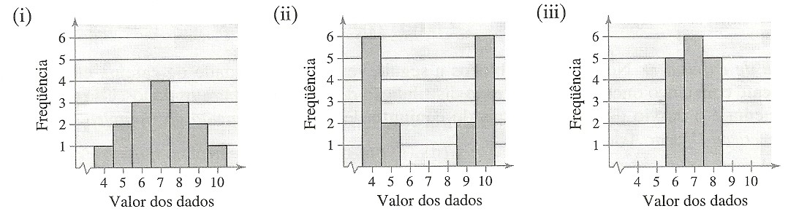

## Variations measures


### Question No. 1

Obtain the total amplitude, average, variance and standart deviation for the two data sets below:

```
Dataset 1:  11   10   8   4   6   7   11   6   11   7

Dataset 2:  15   8   12   5   19   14   8   6   13
```

#### Procedures for the solution of question No. 1

__1º step__ - Sort the data in ascending order.

```
Dataset 1:  4   6   6   7   7   8   10   11   11   11  

Dataset 2:  5   6   8   8   12   13   14   15   19
```

__2º step__ - Then calculate the total amplitude of each data set by subtracting the highest value from the lowest value.

```
Dataset 1:  (11) - (4)
            = 7 value of total amplitude

Dataset 2:  (19) - (5)
            = 14 value of total amplitude
```

__3º step__ - Calculate the arithmetic mean of each data set by applying the formula:

```
x̅ = (1/n) * (x₁ + ... + xₙ)
n: total of values in the data set
xₙ: each individual value in the data set
```

knowing this, arithmetic mean can now be calculate:

```
Dataset 1:  (1 / 10) * (4 + 6 + 6 + 7 + 7 + 8 + 10 + 11 + 11 + 11)
            = 0.1 * 81
            = 8.1 value of arithmetic mean

Dataset 2:  (1 / 9) * (5 + 6 + 8 + 8 + 12 + 13 + 14 + 15 + 19)
            = 0.111... * 100
            = 11.111... value of arithmetic mean
```

__4º step__ - Calculate the standart deviation of each data set by applying the formula:

```
s = √((1/(n-1)) * (xᵢ - x̅)²)
x̅: arithmetic average of data set
n: total of values in the data set
xᵢ: each individual value in the data set
```

knowing this, standart deviation can now be calculate:

```
Dataset 1:  √((1/(10-1)) * ((4 - 8.1)² + (6 - 8.1)² + (6 - 8.1)² + (7 - 8.1)² + (7 - 8.1)² +
                            (8 - 8.1)² + (10 - 8.1)² + (11 - 8.1)² + (11 - 8.1)² + (11 - 8.1)²))
            = √((1/9) * (16.81 + 4.41 + 4.41 + 1.21 + 1.21 + 0.01 + 3.61 + 8.41 + 8.41 + 8.41))
            = √(0.111... * 56.9)
            = √(6.3222...)
            = 2.5144 value of standart deviation

Dataset 2:  √((1/(9-1)) * ((5 - 11.111...)² + (6 - 11.111...)² + (8 - 11.111...)² +
                           (8 - 11.111...)² + (12 - 11.111...)² + (13 - 11.111...)² +
                           (14 - 11.111...)² + (15 - 11.111...)² + (19 - 11.111...)²))
            = √((1/8) * (37.34567765 + 26.12345565 + 9.679011654 + 9.679011654 + 0.7901236543 +
                         3.567901654 + 8.345679654 + 15.12345765 + 62.23456965))
            = √(0.125 * 172.889)
            = √(21.6111...)
            = 4.6487 value of standart deviation
```

__5º step__ - Calculate the variance of each data set by applying the formula:

```
s²
s: standart deviation
```

knowing this, standart deviation can now be calculate:

```
Dataset 1:  (2.514402955)²
            = 6.3222... value of variance

Dataset 2:  (4.648775227)²
            = 21.6111... value of variance
```


### Question No. 2

Samples of annual salaries, in thousands of dollars, from government officials in the city of Los Angeles and Long Beach are listed below:

```
Los Angeles: 	20.2  26.1	20.9	35.9	23.0	28.2	31.6	18.3
Long Beach: 	20.9	18.2	20.8	21.1	26.5	26.9	24.2	25.1
```

a) Obtain the total amplitude, average, variance and standart deviation for each of the data sets
b) Compare the two cities (average salary and standart deviation).

#### Procedures for the solution of question No. 2

__1º step__ - Sort the data in ascending order.

```
LA:   18.3  20.2  20.9  23.0  26.1  28.2  31.6  35.9
LBC:  18.2  20.8	20.9  21.1  24.2  25.1  26.5  26.9
```

__2º step__ - Then calculate the total amplitude of each data set by subtracting the highest value from the lowest value.

```
LA:  (35.9) - (18.3)
     = 17.6 value of total amplitude

LBC: (26.9) - (18.2)
     = 8.7 value of total amplitude
```

__3º step__ - Calculate the arithmetic mean of each data set by applying the formula:

```
x̅ = (1/n) * (x₁ + ... + xₙ)
n: total of values in the data set
xₙ: each individual value in the data set
```

knowing this, arithmetic mean can now be calculate:

```
LA: (1 / 8) * (18.3 + 20.2 + 20.9 + 23.0 + 26.1 + 28.2 + 31.6 + 35.9)
    = 0.125 * 204.2
    = 25.525 value of arithmetic mean

LBC: (1 / 8) * (18.2 + 20.8	+ 20.9 + 21.1 + 24.2 + 25.1 + 26.5 + 26.9)
     = 0.125 * 183.7
     = 22.9625 value of arithmetic mean
```

__4º step__ - Calculate the standart deviation of each data set by applying the formula:

```
s = √((1/(n-1)) * (xᵢ - x̅)²)
x̅: arithmetic average of data set
n: total of values in the data set
xᵢ: each individual value in the data set
```

knowing this, standart deviation can now be calculate:

```
LA:  √((1/(8-1)) * ((18.3 - 25.525)² + (20.2 - 25.525)² + (20.9 - 25.525)² + (23.0 - 25.525)² +
                    (26.1 - 25.525)² + (28.2 - 25.525)² + (31.6 - 25.525)² + (35.9 - 25.525)²))
     = √((1/7) * (52.200625 + 28.355625 + 21.390625 + 6.375625 +
                  0.330625 + 7.155625 + 36.905625 + 107.640625))
     = √(0.1428571429 * 260.355)
     = √(37.19357144)
     = 6.0986 value of standart deviation

LBC: √((1/(8-1)) * ((18.2 - 22.9625)² + (20.8 - 22.9625)² + (20.9 - 22.9625)² + (21.1 - 22.9625)² +
                    (24.2 - 22.9625)² + (25.1 - 22.9625)² + (26.5 - 22.9625)² + (26.9 - 22.9625)²))
     = √((1/7) * (22.68140625 + 4.67640625 + 4.25390625 + 3.46890625 +
                  1.53140625 + 4.56890625 + 12.51390625 + 15.50390625))
     = √(0.1428571429 * 69.19875)
     = √(9.885535717)
     = 3.1441 value of standart deviation
```

__5º step__ - Calculate the variance of each data set by applying the formula:

```
s²
s: standart deviation
```

knowing this, standart deviation can now be calculate:

```
LA:  (6.098653248)²
     = 37.1935 value of variance

LBC: (3.144127179)²
     = 9.8855 value of variance
```

__6º step__ - Lets compare the arithmetic average and standart deviation of the two cities:

```
LA:  25.525 higher salary avg; 6.0986 higher standart deviation.

LBC: 22.9625 lower salary avg; 3.1441 lower standart deviation.

The annual wages of LA vary more than LBC.
```


### Question No. 3

Samples of annual salaries, in thousands of dollars, for teachers from public and private schools are listed below.

```
Public school:  38.6	38.1	38.7	36.8	34.8	35.9	39.9	36.2
Private school: 21.8	18.4	20.3	17.6	19.7	18.3	19.4	20.8
```

a) Obtain the total amplitude, average, variance and standart deviation for each of the data sets.
b) Compare the two education networks (average salary and standart deviation).

#### Procedures for the solution of question No. 3

__1º step__ - Sort the data in ascending order.

```
Public school:  34.8  35.9  36.2  36.8  38.1  38.6	38.7	39.9
Private school: 17.6  18.3  18.4  19.4  19.7	20.3	20.8  21.8
```

__2º step__ - Then calculate the total amplitude of each data set by subtracting the highest value from the lowest value.

```
Public school:  (39.9) - (34.8)
                = 5.1 value of total amplitude

Private school: (21.8) - (17.6)
                = 4.2 value of total amplitude
```

__3º step__ - Calculate the arithmetic mean of each data set by applying the formula:

```
x̅ = (1/n) * (x₁ + ... + xₙ)
n: total of values in the data set
xₙ: each individual value in the data set
```

knowing this, arithmetic mean can now be calculate:

```
Public school:  = (1/8) * (34.8 + 35.9 + 36.2 + 36.8 + 38.1 + 38.6 + 38.7	+ 39.9)
                = 0.125 * 299
                = 37.375 value of arithmetic mean

Private school: = (1/8) * (17.6 + 18.3 + 18.4 + 19.4 + 19.7	+ 20.3 + 20.8 + 21.8)
                = 0.125 * 156.3
                = 19.5375 value of arithmetic mean
```

__4º step__ - Calculate the standart deviation of each data set by applying the formula:

```
s = √((1/(n-1)) * (xᵢ - x̅)²)
x̅: arithmetic average of data set
n: total of values in the data set
xᵢ: each individual value in the data set
```

knowing this, standart deviation can now be calculate:

```
Public school:  √((1/(8-1)) * ((34.8 - 37.375)² + (35.9 - 37.375)² + (36.2 - 37.375)² + (36.8 - 37.375)² +
                               (38.1 - 37.375)² + (38.6 - 37.375)² + (38.7 - 37.375)² + (39.9 - 37.375)²))
                = √((1/7) * (6.630625 + 2.175625 + 1.380625 + 0.330625 +
                             0.525625 + 1.500625 + 1.755625 + 6.375625))
                = √(0.1428571429 * 20.675)
                = √(2.953571429)  
                = 1.7186 value of standart deviation

Private school: √((1/(8-1)) * ((17.6 - 19.5375)² + (18.3 - 19.5375)² + (18.4 - 19.5375)² + (19.4 - 19.5375)² +
                               (19.7 - 19.5375)² + (20.3 - 19.5375)² + (20.8 - 19.5375)² + (21.8 - 19.5375)²))
                = √((1/7) * (3.75390625 + 1.53140625 + 1.29390625 + 0.01890625 +
                             0.02640625 + 0.58140625 + 1.59390625 + 5.11890625))
                = √(0.1428571429 * 13.91875)
                = √(1.988392858)
                = 1.4101 value of standart deviation
```

__5º step__ - Calculate the variance of each data set by applying the formula:

```
s²
s: standart deviation
```

knowing this, standart deviation can now be calculate:

```
Public school:  (1.718595773)²
                = 2.9535 value of variance

Private school: (1.410103846)²
                = 1.9883 value of variance
```

__6º step__ - Lets compare the average salary and standart deviation of the two education networks:

```
Public school:  37.375 higher salary avg; 1.7185 slightly higher standart deviation

Private school: 19.5375 lower salary avg; 1.4101 slightly lower standart deviation

Although the public school has a higher average salary, annual salaries vary more.
```

### Question No. 4

Akhiok is a small fishing village on the island of Kodiak, Alaska. The following census represents the stated age data for the entire population of the 77 inhabitants of Akhiok:

```
28  6  17  48  63  47  27  21  3  7  12
39  50  54  33  45  15  24  1  7  36  53
46  27  5  10  32  50  52  11  42  22  3
17  34  56  25  2  30  10  33  1  49  13
16  8  31  21  6  9  2  11  32  25  0
55  23  41  29  4  51  1  6  31  5  5
4  10  26  12  6  16  8  2  4  28  11
```

Determine the mean and standard deviation of the data set. Then, after building a frequency distribution table, determine the mean and standard deviation of the data set.

#### Procedures for the solution of question No. 4

__1º step__ - Sort the data in ascending order.

```
0  1  1  1  2  2  2  3  3  4  4
4  5  5  5  6  6  6  6  7  7  8
8  9  10  10  10  11  11  11  12  12  13
15  16  16  17  17  21  21  22  23  24  25
25  26  27  27  28  28  29  30  31  31  32
32  33  33  34  36  39  41  42  45  46  47
48  49  50  50  51  52  53  54  55  56  63
```

__2º step__ - Calculate the arithmetic mean of the data set by applying the formula:

```
x̅ = (1/n) * (x₁ + ... + xₙ)
n: total of values in the data set
xₙ: each individual value in the data set
```

knowing this, arithmetic mean can now be calculate:

```
x̅ = (1/77) * (0 + 1 + 1 + 1 + 2 + 2 + 2 + 3 + 3 + 4 + 4
              + 4 + 5 + 5 + 5 + 6 + 6 + 6 + 6 + 7 + 7 + 8
              + 8 + 9 + 10 + 10 + 10 + 11 + 11 + 11 + 12 + 12 + 13
              + 15 + 16 + 16 + 17 + 17 + 21 + 21 + 22 + 23 + 24 + 25
              + 25 + 26 + 27 + 27 + 28 + 28 + 29 + 30 + 31 + 31 + 32
              + 32 + 33 + 33 + 34 + 36 + 39 + 41 + 42 + 45 + 46 + 47
              + 48 + 49 + 50 + 50 + 51 + 52 + 53 + 54 + 55 + 56 + 63)

x̅ = 0.012987 * 1745
x̅ = 22.6623
```

__3º step__ - Calculate the standart deviation of each data set by applying the formula:

```
s = √((1/(n-1)) * (xᵢ - x̅)²)
x̅: arithmetic average of data set
n: total of values in the data set
xᵢ: each individual value in the data set
```

knowing this, standart deviation can now be calculate:

```
s = √((1/(76)) * ((0 - 22.6623)² + (1 - 22.6623)² + (1 - 22.6623)² + (1 - 22.6623)² +
                  (2 - 22.6623)² + (2 - 22.6623)² + (2 - 22.6623)² + (3 - 22.6623)² +
                  (3 - 22.6623)² + (4 - 22.6623)² + (4 - 22.6623)² + (4 - 22.6623)² +
                  (5 - 22.6623)² + (5 - 22.6623)² + (5 - 22.6623)² + (6 - 22.6623)² +
                  (6 - 22.6623)² + (6 - 22.6623)² + (6 - 22.6623)² + (7 - 22.6623)² +
                  (7 - 22.6623)² + (8 - 22.6623)² + (8 - 22.6623)² + (9 - 22.6623)² +
                  (10 - 22.6623)² + (10 - 22.6623)² + (10 - 22.6623)² + (11 - 22.6623)² +
                  (11 - 22.6623)² + (11 - 22.6623)² + (12 - 22.6623)² + (12 - 22.6623)² +
                  (13 - 22.6623)² + (15 - 22.6623)² + (16 - 22.6623)² + (16 - 22.6623)² +
                  (17 - 22.6623)² + (17 - 22.6623)² + (21 - 22.6623)² + (21 - 22.6623)² +
                  (22 - 22.6623)² + (23 - 22.6623)² + (24 - 22.6623)² + (25 - 22.6623)² +
                  (25 - 22.6623)² + (26 - 22.6623)² + (27 - 22.6623)² + (27 - 22.6623)² +
                  (28 - 22.6623)² + (28 - 22.6623)² + (29 - 22.6623)² + (30 - 22.6623)² +
                  (31 - 22.6623)² + (31 - 22.6623)² + (32 - 22.6623)² + (32 - 22.6623)² +
                  (33 - 22.6623)² + (33 - 22.6623)² + (34 - 22.6623)² + (36 - 22.6623)² +
                  (39 - 22.6623)² + (41 - 22.6623)² + (42 - 22.6623)² + (45 - 22.6623)² +
                  (46 - 22.6623)² + (47 - 22.6623)² + (48 - 22.6623)² + (49 - 22.6623)² +
                  (50 - 22.6623)² + (50 - 22.6623)² + (51 - 22.6623)² + (52 - 22.6623)² +
                  (53 - 22.6623)² + (54 - 22.6623)² + (55 - 22.6623)² + (56 - 22.6623)² +
                  (63 - 22.6623)²))

s = √(0.0131 * 23441.22078)
s = √308.4371155
s = 17.5623
```

__4º step__ - Build the frequency distribution table.

| Ages *(x)* | *fᵢ* | *x^* | *x^ * fᵢ* | *Fᵢ* |
|:----------:|:----:|:----:|:---------:|:----:|
|  0\|---11  |  27  |  5.5 |   148.5   |  27  |
|  11\|---22 |  13  | 16.5 |   214.5   |  40  |
|  22\|---33 |  16  | 27.5 |    440    |  56  |
|  33\|---44 |   7  | 38.5 |   269.5   |  63  |
|  44\|---55 |  11  | 49.5 |   544.5   |  74  |
|  55\|---66 |   3  | 60.5 |   181.5   |  77  |
|  __TOTAL__ |  77  |  198 |   1798.5  |  ### |

__5º step__ - Calculate the arithmetic mean for tabular data.

```
x̅ =
      ∑(fᵢ*x^ᵢ)
    ————————————
        ∑ fᵢ
fᵢ: relative frequency of xᵢ
x^ᵢ: midpoint of xᵢ
∑(fᵢ*x^ᵢ): summation of the product of fᵢ and x^ᵢ, for all instances of xᵢ
∑ fᵢ: summation of fᵢ, for all instances of xᵢ
```

knowing this, the arithmetic mean can now be calculate:

```
x̅ = 1798.5 ÷ 77
x̅ = 23.3571
```

__6º step__ - Calculate the arithmetic mean for tabular data.

```
s = √ ( ∑((x^ᵢ - x̅)² * fᵢ) ÷ (n-1))

fᵢ: relative frequency of the x^ᵢ class
x^ᵢ: midpoint of each class
x̅: arithmetic mean of the tabular data
n: sum of all relative frequencies
```

knowing this, the standard deviation can now be calculate:

```
s = √( ((5.5 - 23.35714286)² * 27 + (16.5 - 23.35714286)² * 13 + (27.5 - 23.35714286)² * 16 +
        (38.5 - 23.35714286)² * 7 + (49.5 - 23.35714286)² * 11 + (60.5 - 23.35714286)² * 3 ) ÷ (77-1))

s = √( (8609.69388 + 611.2653066 + 274.6122445 + 1605.142857 + 7517.938774 + 4138.77551) ÷ 76)

s = √(22757.42857 ÷ 76)

s = √299.4398496

s = 17.3043
```

__7º step__ - Answer the questions.

Raw data: a) arithmetic mean = __22.6623__, b) standard deviation = __17.5623__  
Tabular data: a) arithmetic mean = __23.3571__, b) standard deviation = __17.3043__  

### Question No. 5

#### Procedures for the solution of question No. 5


### Question No. 6

Without calculating, what is the set with the largest sample standard deviation? Which has the lowest sample standard deviation? Explain your reasoning.



#### Procedures for the solution of question No. 6


### Question No. 7

#### Procedures for the solution of question No. 7


### Question No. 8

#### Procedures for the solution of question No. 8


### Question No. 9

#### Procedures for the solution of question No. 9


### Question No. 10

#### Procedures for the solution of question No. 10


### Question No. 11

#### Procedures for the solution of question No. 11


### Question No. 12

#### Procedures for the solution of question No. 12


### Question No. 13

#### Procedures for the solution of question No. 13
