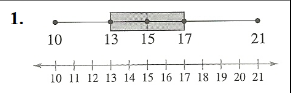
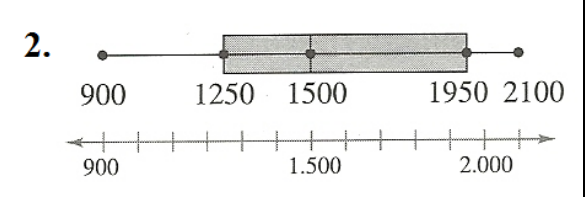
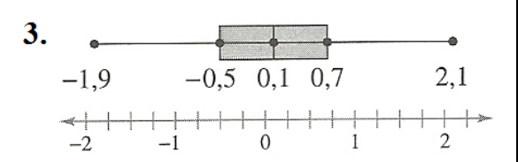
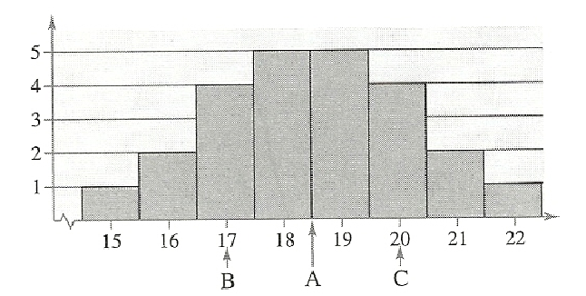

# Measures of position

## Summary

- [__Question No. 1__](https://github.com/Bodera/learnPath_Mathematics/blob/master/statistics/solved-list2.md#question-no-1)
- [__Question No. 2__](https://github.com/Bodera/learnPath_Mathematics/blob/master/statistics/solved-list2.md#question-no-2)
- [__Question No. 3__](https://github.com/Bodera/learnPath_Mathematics/blob/master/statistics/solved-list2.md#question-no-3)
- [__Question No. 4__](https://github.com/Bodera/learnPath_Mathematics/blob/master/statistics/solved-list2.md#question-no-4)
- [__Question No. 5__](https://github.com/Bodera/learnPath_Mathematics/blob/master/statistics/solved-list2.md#question-no-5)
- [__Question No. 6__](https://github.com/Bodera/learnPath_Mathematics/blob/master/statistics/solved-list2.md#question-no-6)
- [__Question No. 7__](https://github.com/Bodera/learnPath_Mathematics/blob/master/statistics/solved-list2.md#question-no-7)
- [__Question No. 8__](https://github.com/Bodera/learnPath_Mathematics/blob/master/statistics/solved-list2.md#question-no-8)
- [__Question No. 9__](https://github.com/Bodera/learnPath_Mathematics/blob/master/statistics/solved-list2.md#question-no-9)
- [__Question No. 10__](https://github.com/Bodera/learnPath_Mathematics/blob/master/statistics/solved-list2.md#question-no-10)
- [__Question No. 11__](https://github.com/Bodera/learnPath_Mathematics/blob/master/statistics/solved-list2.md#question-no-11)
- [__Question No. 12__](https://github.com/Bodera/learnPath_Mathematics/blob/master/statistics/solved-list2.md#question-no-12)
- [__Question No. 13__](https://github.com/Bodera/learnPath_Mathematics/blob/master/statistics/solved-list2.md#question-no-13)
- [__Question No. 14__](https://github.com/Bodera/learnPath_Mathematics/blob/master/statistics/solved-list2.md#question-no-14)
- [__Question No. 15__](https://github.com/Bodera/learnPath_Mathematics/blob/master/statistics/solved-list2.md#question-no-15)
- [__Question No. 16__](https://github.com/Bodera/learnPath_Mathematics/blob/master/statistics/solved-list2.md#question-no-16)
- [__Question No. 17__](https://github.com/Bodera/learnPath_Mathematics/blob/master/statistics/solved-list2.md#question-no-17)

### Question No. 1

From the boxplot shown, identify the following:

- Minimum entry
- Maximum entry
- First quartile
- Second quartile
- Third quartile
- Interquartile range



#### Procedures for the solution of question No. 1

__1st step__: Answer the question.

```txt
Min entry = 10
Max entry = 21
Q₁ = 13
Q₂ = 15
Q₃ = 17
IQR = (Q₃ - Q₁) = 4
```

### Question No. 2

From the boxplot shown, identify the following:

- Minimum entry
- Maximum entry
- First quartile
- Second quartile
- Third quartile
- Interquartile range



#### Procedures for the solution of question No. 2

__1st step__: Answer the question.

```txt
Min entry = 900
Max entry = 2100
Q₁ = 1250
Q₂ = 1500
Q₃ = 1950
IQR = (Q₃ - Q₁) = 700
```

### Question No. 3

From the boxplot shown, identify the following:

- Minimum entry
- Maximum entry
- First quartile
- Second quartile
- Third quartile
- Interquartile range



#### Procedures for the solution of question No. 3

__1st step__: Answer the question.

```txt
Min entry = -1.9
Max entry = 2.1
Q₁ = -0.5
Q₂ = 0.1
Q₃ = 0.7
IQR = (Q₃ - Q₁) = 1.2
```

### Question No. 4

The letters __A__, __B__ and __C__ are marked in the histogram below. Associate them with Q1, Q2 and Q3. Justify your reasoning.



#### Procedures for the solution of question No. 4

__1st step__: Associate the points with the quartiles.

```txt
B = Q₁
A = Q₂ (A is representing the median of 18.5)
C = Q₃

This is because we can see that ¼ of the data falls on 17 or less, and ¾ of the data falls on 20 or less. In addition the histogram represents a Gaussian distribution.
```

### Question No. 5

The following census represents the stated age data for the entire population of the 77 inhabitants of Akhiok, Alaska.

Determine the 1º, 2º and 3º quartiles for the ages of Akhiok residents. Use the data set below:

```txt
28  6  17  48  63  47  27  21  3  7  12
39  50  54  33  45  15  24  1  7  36  53
46  27  5  10  32  50  52  11  42  22  3
17  34  56  25  2  30  10  33  1  49  13
16  8  31  21  6  9  2  11  32  25  0
55  23  41  29  4  51  1  6  31  5  5
4  10  26  12  6  16  8  2  4  28  11
```

#### Procedures for the solution of question No. 5

__1st step__: Sort the data in ascending order.

```txt
0  1  1  1  2  2  2  3  3  4  4
4  5  5  5  6  6  6  6  7  7  8
8  9  10  10  10  11  11  11  12  12  13
15  16  16  17  17  21  21  22  23  24  25
25  26  27  27  28  28  29  30  31  31  32
32  33  33  34  36  39  41  42  45  46  47
48  49  50  50  51  52  53  54  55  56  63
```

__2nd step__: Create a frequency distribution table.

|   *x*   | *x^* | *fᵢ* | *Fᵢ* |
|:-------:|:----:|:----:|:----:|
|  0---9  |  4.5 |  24  |  24  |
| 10---19 | 14.5 |  14  |  38  |
| 20---29 | 24.5 |  13  |  51  |
| 30---39 | 34.5 |  10  |  61  |
| 40---49 | 44.5 |   7  |  68  |
| 50---59 | 54.5 |   8  |  76  |
| 60---69 | 64.5 |   1  |  77  |

__3rd step__: Calculate the quartiles.

Quartile formula for grouped data:

```txt
Qᵢ = Lim inf + h * (((i*n) ÷ 4 - Fant) ÷ f)

i = quartile to be calculated (1, 2 or 3).
Lim inf = lower limit of the Qᵢ class.
h = amplitude of the Qᵢ class.
n = total frequencies.
Fant = cumulative frequency before the Qᵢ class.
f = relative frequency of the Qᵢ class.
```

knowing this, we will discover the class corresponding to each quartile.

```txt
Q₁ class = (1 * 77) ÷ 4 = 19.25
Q₁ class = 0---9 (acum freq is 24)

Q₂ class = (2 * 77) ÷ 4 = 38.5
Q₂ class = 20---29 (acum freq is 51)

Q₃ class = (3 * 77) ÷ 4 = 57.75
Q₃ class = 30---39 (acum freq is 61)
```

we can now apply the formula and calculate the quartiles.

```txt
Q₁ = 0 + 10 * (((1*77) ÷ 4 - 0) ÷ 24)
Q₁ = 0 + 10 * (19.25 - 0) ÷ 24)
Q₁ = 0 + 10 * 0.8020
Q₁ = 8.02

Q₂ = 20 + 10 * (((2*77) ÷ 4 - 38) ÷ 13)
Q₂ = 20 + 10 * ((38.5 - 38) ÷ 13)
Q₂ = 20 + 10 * (0.5 ÷ 13)
Q₂ = 20 + 10 * 0.0384
Q₂ = 20 + 0.3846
Q₂ = 20.3846

Q₃ = 30 + 10 * (((3*77) ÷ 4 - 51) ÷ 10)
Q₃ = 30 + 10 * ((57.75 - 51) ÷ 10)
Q₃ = 30 + 10 * (6.75 ÷ 10)
Q₃ = 30 + 10 * 0.25
Q₃ = 30 + 2.75
Q₃ = 35.75
```

### Question No. 6

#### Procedures for the solution of question No. 6

### Question No. 7

#### Procedures for the solution of question No. 7

### Question No. 8

#### Procedures for the solution of question No. 8

### Question No. 9

#### Procedures for the solution of question No. 9

### Question No. 10

#### Procedures for the solution of question No. 10

### Question No. 11

#### Procedures for the solution of question No. 11

### Question No. 12

#### Procedures for the solution of question No. 12

### Question No. 13

#### Procedures for the solution of question No. 13

### Question No. 14

#### Procedures for the solution of question No. 14

### Question No. 15

#### Procedures for the solution of question No. 15

### Question No. 16

#### Procedures for the solution of question No. 16

### Question No. 17

#### Procedures for the solution of question No. 17
